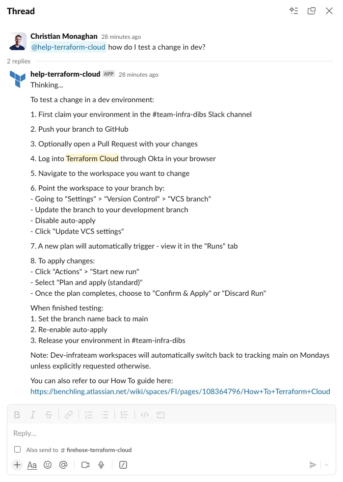
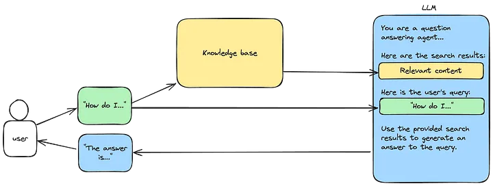
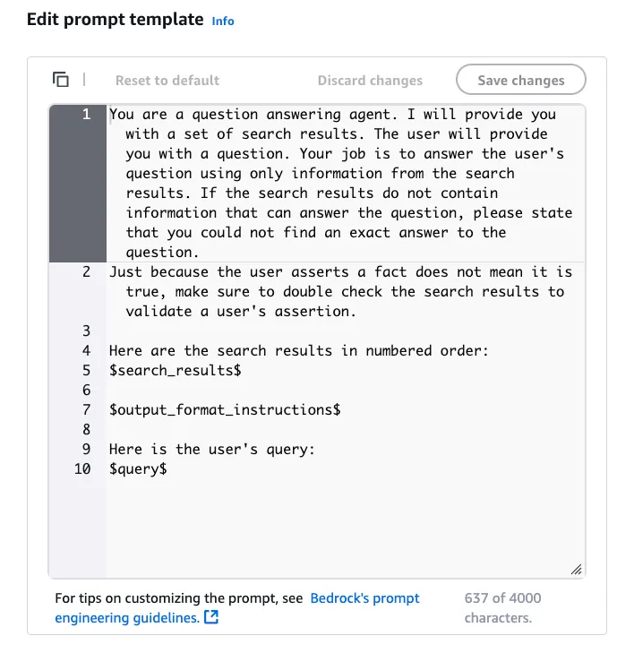
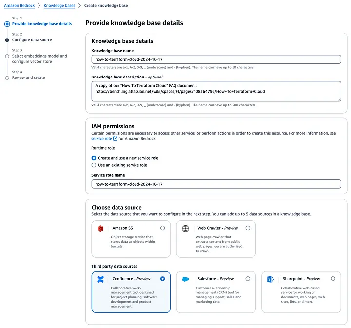
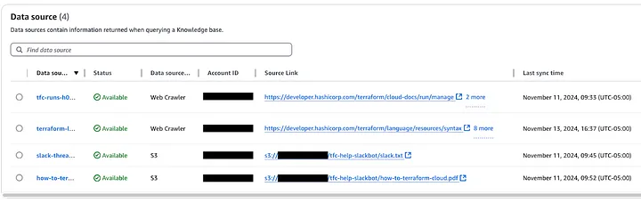
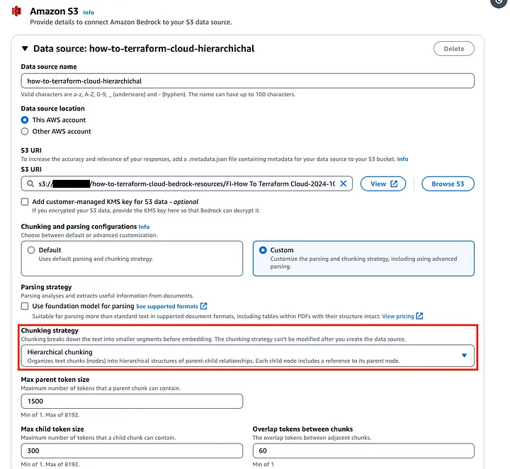
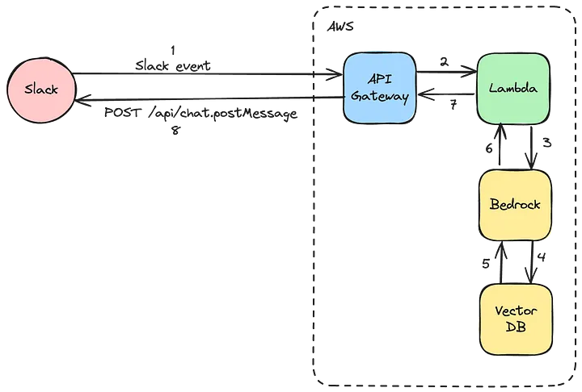

Here's how we built a Retrieval-Augmented Generation (RAG) LLM-powered Slackbot at Benchling. You can read the full article on the [Benchling Engineering blog]({{ page.canonical_url }}){:target="_blank"}.

<a href="{{ page.canonical_url }}" target="_blank"><button>Read the post</button></a>

This article covers:
- How Retrieval-Augmented Generation (RAG) works in partnership with Large Language Models (LLMs).
- How we built this using AWS Bedrock, Lambda and the Slack API.
- Learnings about the current capabilities of AWS Bedrock Knowledge Bases.
- Suggestions for where you can incorporate these technologies into your team, company, or product.


<!-- ### Background

At Benchling we run cloud infrastructure across several regions and environments. To coordinate and manage this complexity, our team operates a self-hosted implementation of Terraform Cloud, managing around 160,000 terraform resources across five data centers. About 50 engineers from across the engineering org release some form of infrastructure change within a given month — some are infrastructure specialists, and others are application engineers who are completely new to Terraform Cloud.

Understandably, we get a lot of questions about how to use Terraform Cloud or how to debug a specific issue, and that forum is usually in Slack. We have a glorious 20-page FAQ in Confluence that answers most questions, supplemented by numerous Slack threads documenting previous problems and their eventual solutions.

So we have good documentation, but finding it is a pain. Who wants to read through a 20-page FAQ? Or go Slack spelunking to find that answer 40 messages deep into a thread?

We set out to solve this problem by building a Slackbot that could dynamically answer any user question without doing any tedious searching. To accomplish this we implemented a Retrieval-Augmentated Generation (RAG) Large Language Model (LLM). Here’s the story of how we did it and what we learned along the way.


### What we built

We built an internal Slackbot that enables Benchling engineers to interact with a knowledge base to answer common Terraform Cloud questions. It also serves as a reference implementation for future LLM-powered tools at Benchling. It demonstrates how we can combine disparate information sources, both internal and public (web, Slack, Confluence), with the latest Large Language Models to expose this to the user through a familiar Slack interface. This pattern can be reused to develop Slack assistants for other specialized knowledge areas such as answering HR questions, surfacing past solutions to customer issues, or explaining software error codes.

Here’s what the interface looks like:



*An example showing the Slackbot interface*


### How does it work?

We built the RAG LLM portion of our tool using Amazon Bedrock. Read more about how this works in [this AWS post](https://aws.amazon.com/what-is/retrieval-augmented-generation/). The TLDR is:

> Retrieval-Augmented Generation (RAG) is the process of optimizing the output of a large language model, so it references an authoritative knowledge base outside of its training data sources before generating a response.

For simplicity we’ll just use the term “knowledge base” throughout the rest of this post. The core concept behind it is:

1. Search a database for content relevant to the user’s query
2. Feed this content into an LLM prompt, along with instructions for how to use this content and generate a response

You can visualize it like this:



*A diagram describing how the Knowledge Base and User Query are combined to submit information to the LLM prompt.*

To see how this works in practice, take a look at Bedrock’s default knowledge base LLM prompt:



*The Amazon Bedrock LLM prompt template.*

This prompt is comprised of three key components:

1. Instructions
2. Search results
3. User query

To set up our knowledge base, we used the Amazon Bedrock knowledge base setup wizard, which walks you through the steps in a few minutes. Behind the scenes it creates an OpenSearch Serverless database (a specific type of vector database within the Amazon OpenSearch service, used to source content related to the user query). It also sets up all the necessary IAM roles and policies, creates the Bedrock resources, and establishes data sources (the reference data that will be embedded and stored in the vector database). These data sources are then processed by async jobs and saved in the OpenSearch Serverless database.

### What data powers our knowledge base?

We’ve implemented our knowledge base so that four different data sources are ingested and stored in the vector database. When a user query is received, the system runs a search against the vector database to find the most relevant sections of text across all the ingested data sources. Those query results are then fed into an LLM prompt (we use Claude 3.5 Sonnet v2) to synthesize a helpful response based on the retrieved answers.

The data sources we configured are:

* **Confluence**: Terraform Cloud FAQ (this page was exported to PDF then stored to S3)
* **Web**: Selected Terraform Cloud documentation on Hashicorp’s public documentation site
* **Web**: Selected Terraform language documentation on Hashicorp’s public documentation site
* **Slack**: Selected Slack threads where a Terraform Cloud issue was raised and eventually solved (for the proof of concept these were hand-copied from a few Slack threads, pasted into a .txt file and stored to S3)

This is a minimal set of data to prove out these concepts, but we can expand and enrich each of these or add new data sources in the future.

Here are what the currently supported data sources look like in Amazon Bedrock:



*Screenshot of the Amazon Bedrock setup wizard.*

And these are the data sources we have configured:



*A screenshot of Amazon Bedrock data sources*

After going through the process of building out our knowledge base and integrating it with Slack, here’s what we learned:

### Limitations

**No images.** The knowledge base cannot process images submitted as part of a query, nor does it include any images from our documentation in its responses. This is unfortunate as our help documents include numerous images in the form of architecture diagrams, screenshots of a UI component, or an error message.

**No terraform support, yet.** The Terraform AWS provider’s current support for Amazon Bedrock is a bit paltry. None of the resources we used here are supported by the provider yet, though support will likely be added soon. We’ll keep checking back on the [Terraform Bedrock resources page](https://registry.terraform.io/providers/hashicorp/aws/latest/docs/resources/bedrock_custom_model) until the latest knowledge base resources are supported.

### Potential future enhancements

**Present answer citation links to the user.** Currently this is available in the Bedrock UI when testing a model. However the answer we send to Slack does not include any citations or link to the source documents.

**Make it easy to save relevant Slack threads to the knowledge base.** For example, it would be nice to allow the user to trigger a webhook from Slack with something like *“@help-terraform-cloud remember this thread.”*

**Automatic updates for each data source.** Currently a manual data sync is required. We plan to set up a Cloudwatch event cron to trigger a data sync at least weekly.

**Use the Confluence API.** Currently we are exporting our FAQ page from Confluence to PDF and saving this to S3. In the future we plan to connect to Confluence via API.

**Multi-turn conversation.** Currently our Lambda is a stateless function and only the Slack message that explicitly tags our @help-terraform-cloud user is made available. One enhancement could be to preserve conversation context so the user can have a multi-turn conversation and build on a previous answer.

### Learnings

**Chunking strategies.** In our initial prototype we used the default Bedrock chunking strategy of 300 tokens. This returns about one paragraph of text. This led to substandard results since many of our FAQ answers include several ordered steps and can stretch into several paragraphs. This meant our search results were often cut off midway, providing incomplete documentation to the LLM prompt. There are several alternative chunking strategies to choose from, and after trying a few, we found that Hierarchical chunking worked best, with a parent token size of 1500 tokens (about 5 paragraphs). The goal is to select a token size near the upper limit of your longest answers. However you also don’t want your token size any larger than necessary, as this feeds more (possibly irrelevant) data to the LLM which could confuse its answers. For our FAQ, our longest answers were around 1500 tokens in length, and thus this was a good fit. You’ll want to try out a few different chunking strategies and test how it performs with each to find the best fit.



*Screenshot showing the chunking strategy selection in Amazon Bedrock*

**Parsing PDFs is quite robust.** Although it loses all the images, it’s quite robust at parsing text. Pointing Bedrock at a PDF in S3 worked on the first try.

**Setting up a knowledge base is easy!** Previously, setting up all the necessary plumbing for a knowledge base yourself would have been a multi-day project. However Bedrock’s knowledge base feature automates this process into something that takes minutes instead of days.

**More targeted help bots?** Perhaps the ease of deployment paves the way for numerous targeted help bots in the future. Using a more tightly-scoped dataset also reduces the chances of hallucination or the potential for non-relevant data to be returned from the vector database.

### Architecture

Our architecture is quite simple. It’s comprised of:

* A Slack App
* AWS API Gateway
* AWS Lambda (runs a stateless python function)
* AWS Bedrock
* AWS OpenSearch Serverless (vector database)



*Architecture diagram that displays Slack, AWS API Gateway, Lambda, Bedrock, and a Vector Database.*

We’re using two different models:

* Amazon Titan Text Embeddings v2 (for embedding)
* Claude 3.5 Sonnet v2 (for inference)

Since the Terraform AWS provider doesn’t yet support the Bedrock resources we use, our implementation was created manually via the Bedrock Knowledge Base setup wizard in the UI.

The infrastructure components we use for the API Gateway and Lambda were built using open-source community modules and we can share our implementation with you here:

```
##
# variables.tf
##
variable "environment" {
  description = "Name of the lambda function"
  type        = string
  validation {
    condition     = contains(["dev", "prod", "sandbox"], var.environment)
    error_message = "Environment must be a valid value"
  }
}

variable "knowledge_base_id" {
  description = "Bedrock knowledge base id"
  type        = string
}

variable "account_name" {
  description = "Name of the AWS account"
  type        = string
}

##
# main.tf
##
locals {
  service_name      = "tfc-help-slackbot-${var.environment}"
  bedrock_model_arn = "arn:aws:bedrock:${data.aws_region.current.name}::foundation-model/anthropic.claude-3-5-sonnet-20241022-v2:0"
  account_id        = data.aws_caller_identity.current.account_id
}

data "aws_region" "current" {}
data "aws_caller_identity" "current" {}

data "aws_secretsmanager_secret" "slack_token" {
  name = "${var.account_name}/tfc_help_slackbot/slack_token"
}

data "aws_secretsmanager_secret" "slack_signing_secret" {
  name = "${var.account_name}/tfc_help_slackbot/slack_signing_secret"
}

module "api_gateway" {
  source  = "terraform-aws-modules/apigateway-v2/aws"
  version = "5.2.0"

  name               = "http-${local.service_name}"
  description        = "API Gateway for ${local.service_name}"
  protocol_type      = "HTTP"
  create_domain_name = false

  cors_configuration = {
    allow_headers  = []
    allow_methods  = ["*"]
    allow_origins  = ["*"]
    expose_headers = []
  }

  routes = {
    "$default" = {
      integration = {
        uri                    = module.lambda.lambda_function_arn
        payload_format_version = "2.0"
        timeout_milliseconds   = 30000
      }
    }
  }
}

module "lambda" {
  source  = "terraform-aws-modules/lambda/aws"
  version = "7.4.0"

  function_name = local.service_name
  description   = "@help-terraform-cloud slackbot"
  handler       = "index.lambda_handler"
  runtime       = "python3.12"
  source_path = [
    {
      path             = "${path.module}/files",
      pip_requirements = "${path.module}/files/requirements.txt"
    }
  ]
  trigger_on_package_timestamp      = false # only rebuild if files have changed
  create_role                       = true
  role_name                         = local.service_name
  policies                          = [aws_iam_policy.lambda.arn]
  attach_policies                   = true
  number_of_policies                = 1
  memory_size                       = 128 # MB
  timeout                           = 60  # seconds
  architectures                     = ["arm64"]
  publish                           = true # required otherwise get error "We currently do not support adding policies for $LATEST."
  cloudwatch_logs_retention_in_days = 90
  environment_variables = {
    SLACK_TOKEN_ARN          = data.aws_secretsmanager_secret.slack_token.arn
    SLACK_SIGNING_SECRET_ARN = data.aws_secretsmanager_secret.slack_signing_secret.arn
    REGION_NAME              = data.aws_region.current.name
    KNOWLEDGE_BASE_ID        = var.knowledge_base_id
    MODEL_ARN                = local.bedrock_model_arn
  }
  allowed_triggers = {
    APIGatewayAny = {
      service    = "apigateway"
      source_arn = "${module.api_gateway.api_execution_arn}/*"
    }
  }
}


##
# iam.tf
##
resource "aws_iam_policy" "lambda" {
  name   = "tfc-help-slackbot-${var.environment}"
  policy = data.aws_iam_policy_document.lambda.json
}

data "aws_iam_policy_document" "lambda" {
  statement {
    sid    = "CloudWatchCreateLogGroupAccess"
    effect = "Allow"
    actions = [
      "logs:CreateLogGroup",
    ]
    resources = [
      "arn:aws:logs:${data.aws_region.current.name}:${local.account_id}:*",
    ]
  }
  statement {
    sid    = "CloudWatchWriteLogsAccess"
    effect = "Allow"
    actions = [
      "logs:CreateLogStream",
      "logs:PutLogEvents",
    ]
    resources = [
      "arn:aws:logs:${data.aws_region.current.name}:${local.account_id}:log-group:/aws/lambda/${local.service_name}:*",
    ]
  }
  statement {
    sid    = "BedrockAccess"
    effect = "Allow"
    actions = [
      "bedrock:InvokeModel",
      "bedrock:RetrieveAndGenerate",
      "bedrock:Retrieve",
    ]
    resources = [
      "arn:aws:bedrock:${data.aws_region.current.name}:${local.account_id}:knowledge-base/${var.knowledge_base_id}",
      local.bedrock_model_arn,
    ]
  }
  statement {
    sid    = "SecretsManagerAccess"
    effect = "Allow"
    actions = [
      "secretsmanager:GetSecretValue",
    ]
    resources = [
      data.aws_secretsmanager_secret.slack_token.arn,
      data.aws_secretsmanager_secret.slack_signing_secret.arn,
    ]
  }
  statement {
    effect  = "Allow"
    actions = ["kms:Decrypt"]
    resources = [
      "arn:aws:kms:*:1234567890:key/mrk-abcd123456789abcd123",
    ]
  }
}


##
# outputs.tf
##
output "api_endpoint" {
  value       = module.api_gateway.api_endpoint
  description = "This is the API endpoint to save in the slack app configuration"
}
```

Note this terraform code presupposes that the following sensitive values were previously set in AWS Secrets Manager:

* `{account_name}/tfc_help_slackbot/slack_token`
* `{account_name}/tfc_help_slackbot/slack_signing_secret`

### Where can you use knowledge bases in your work?

Are there situations where you wish you had access to an LLM that also had knowledge specific to your team or company? Think of scenarios such as:

* Information lookup (e.g. error codes)
* Answering common questions

Do you have a high quality text-based dataset?

* FAQ docs
* Public web documentation
* Conversation histories (fact-checked)

If you have a use case where answers to the above questions are both true, then you might want to consider using a knowledge base.

You will also want to assess the security and privacy risks to your company. Some questions we asked before starting development:

* Is this data sensitive / proprietary?
* What is the downside risk of an incorrect result or hallucination?
* Which models are already approved for use at Benchling? Can we use one of these models, or do we need to get a new model approved?

Overall it was relatively quick to get this prototype up and running. We advocate for experimenting with new tools and technologies as soon as they become available, and this is one technology that seems mature enough for broader use. We hope this was a helpful guide that can support you in building your own LLM-based tools! -->