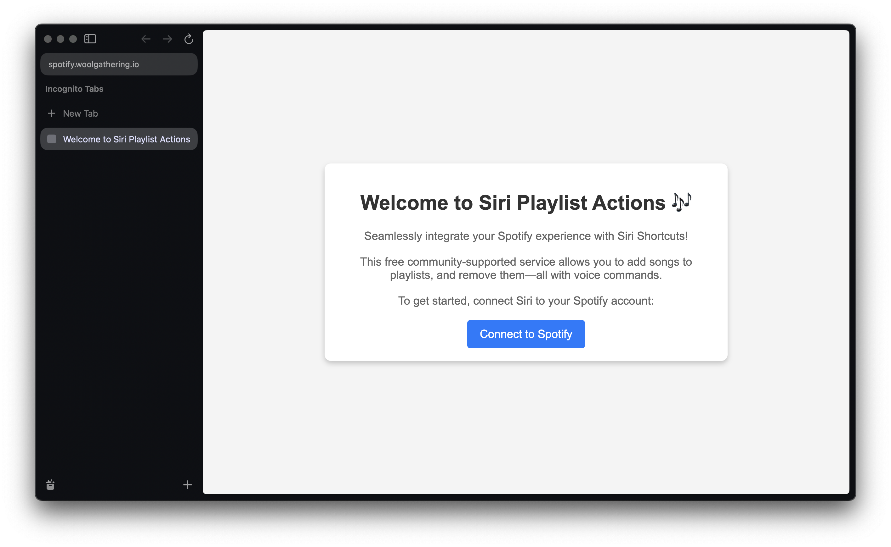
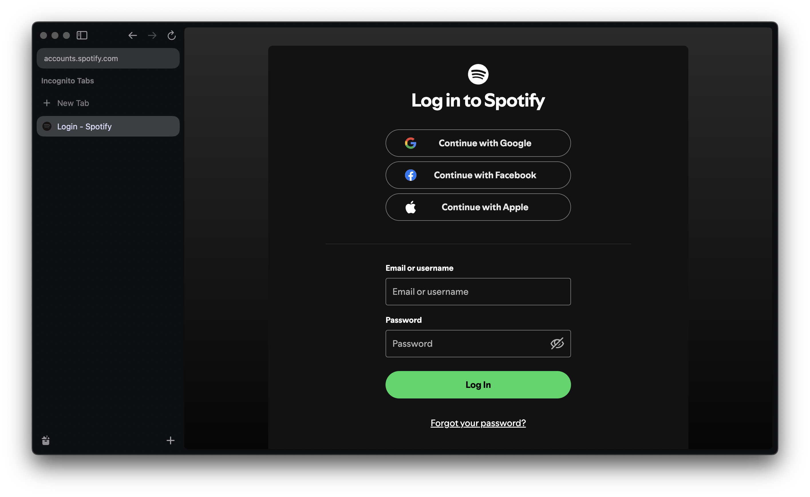
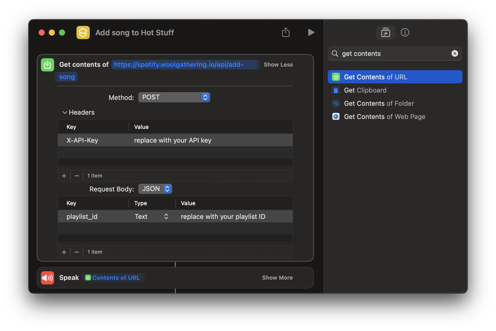

I've fully refactored the service into serverless functions, deployed to Vercel, and now have the site hosted at [https://spotify.woolgathering.io/](https://spotify.woolgathering.io/)!

This allows any user to use the service, without running a local server.

Here's what the user flow looks like:

