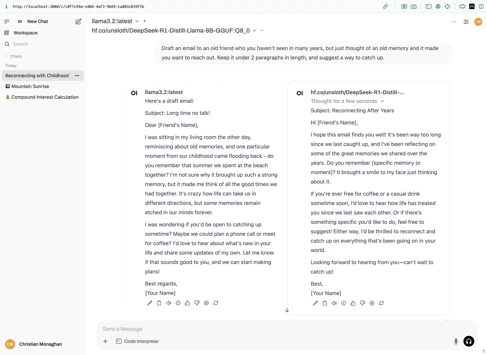

I want to try fine-tuning locally on my macbook M4. Unfortunately I can't use Unsloth since a mac [doesn't meet the Unsloth system requirements](https://docs.unsloth.ai/get-started/beginner-start-here/unsloth-requirements). I'm sure I can still fine-tune locally, but just won't be able to use Unsloth. 

I did see the Unsloth team put out a new [Tutorial: How to Run DeepSeek-R1 on your own local device](https://docs.unsloth.ai/basics/tutorial-how-to-run-deepseek-r1-on-your-own-local-device#running-on-mac-apple-devices). Rather than running in the terminal via `ollama`, which I did a few days ago, this can be run via a local webserver so you can interact with the model locally via web UI. It's also a much larger version of the R1 model, and hence more capable (though will also be slower to run on my local hardware). The Open WebUI team has a post [Run DeepSeek R1 Dynamic 1.58-bit with Llama.cpp](https://docs.openwebui.com/tutorials/integrations/deepseekr1-dynamic/) which explains how to run this locally via an M4 Max with 128GB of memory (hey that's what I have)!

I still want to focus my learning on fine-tuning locally, but might do a side quest on this tutorial since it's not that long and I can get at least get the distilled R1 model downloading in the background (it's 131GB!) while I keep looking into good methods for learning to fine-tune locally.

## Side Quest:

```
# install llama.cpp
brew install llama.cpp
# verify it's now available my path
which llama-cli
```

I created a new directory, with a single file:

```
mkdir ai-deepseek-r1-local
cd ai-deepseek-r1-local
touch download.py
```

With this code in download.py:

```
# Install Hugging Face dependencies before running this:
# pip install huggingface_hub hf_transfer

from huggingface_hub import snapshot_download

snapshot_download(
    repo_id = "unsloth/DeepSeek-R1-GGUF",  # Specify the Hugging Face repo
    local_dir = "DeepSeek-R1-GGUF",         # Model will download into this directory
    allow_patterns = ["*UD-IQ1_S*"],        # Only download the 1.58-bit version
)
```

Then ran:

```
pip install huggingface_hub hf_transfer
python download.py
```

And it looks like this will take 3.5 hrs to download on my current internet connection.

Meanwhile, let's install Open WebUI:
```
docker run -d -p 3000:8080 --add-host=host.docker.internal:host-gateway -v open-webui:/app/backend/data --name open-webui --restart always ghcr.io/open-webui/open-webui:main
open localhost:3000
```

And look, it already found the models I had available from ollama! Here's the R1 distilled model I downloaded a few days ago:


We can also try two models side by side. Here we compare distilled versions of llama3.2 and DeepSeek-R1:



Pretty cool!

I added a new model `llava` for image recognition, which I downloaded and ran with:

```
ollama run llava:7b
```
It seems prone to infer the image contents from the filename or to hallucinate some completely unrelated image if it can't read the provided filename. However, when it gets it right, it's spot on.

It doesn't immediately show up in Open WebUI, but a docker restart of the Open WebUI container does the trick:

```
docker container ls
docker restart {container_id}
```


It also looks like [Open WebUI can be used for image generation](https://docs.openwebui.com/tutorials/images/) models as well. Let's try it out!

I'm following this guide for [installing stable diffusion on Apple Silicon](https://github.com/AUTOMATIC1111/stable-diffusion-webui/wiki/Installation-on-Apple-Silicon)

For step 4 I went with the "Stable Diffusion 1.5" model.

I see ComfyUI mentioned in lots of places, so maybe something to install in the future. Here are the [ComfyUI installation instructions for apple silicon](https://github.com/comfyanonymous/ComfyUI?tab=readme-ov-file#apple-mac-silicon).

Once downloaded, I moved it into the specified folder, then ran:

```
./webui.sh --api --listen
docker run -d -p 3000:8080 --add-host=host.docker.internal:host-gateway -e AUTOMATIC1111_BASE_URL=http://host.docker.internal:7860/ -e ENABLE_IMAGE_GENERATION=True -v open-webui:/app/backend/data --name open-webui --restart always ghcr.io/open-webui/open-webui:main
```

Ok, back to the 131GB of deepseek-R1 finally finished downloading, so back to that. Let's run:

```
llama-server \
    --model ~/code/ai-deepseek-r1-local/DeepSeek-R1-GGUF/DeepSeek-R1-UD-IQ1_S/DeepSeek-R1-UD-IQ1_S-00001-of-00003.gguf \
    --port 10000 \
    --ctx-size 1024 \
    --n-gpu-layers 40
```

It runs!

Now I follow the steps to hook it into Open WebUI and submit a prompt. It works! 

Though it did take 9 minutes to generate this response:


The "thought for 4 minutes" is misleading because it actually spent 5 minutes unresponsive before it started to generate the "thinking" tokens.

And in the end, the haiku it generates is incorrect. The second line is 9 syllables instead of 7. And there's a random fourth line that nobody asked for. 


But still pretty cool I could run it locally! Though I have to say this is way more work than just running the smaller quantized version from ollama.
