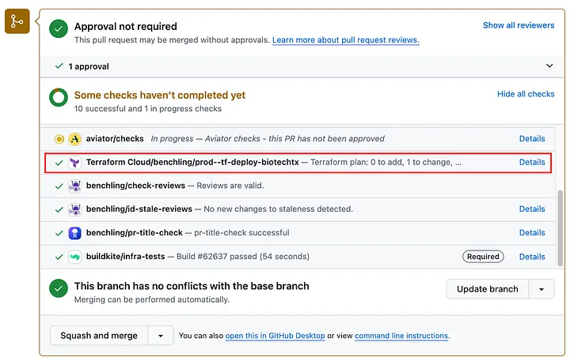
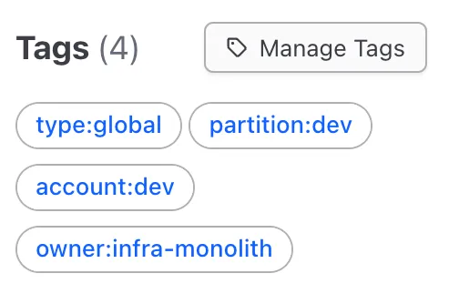
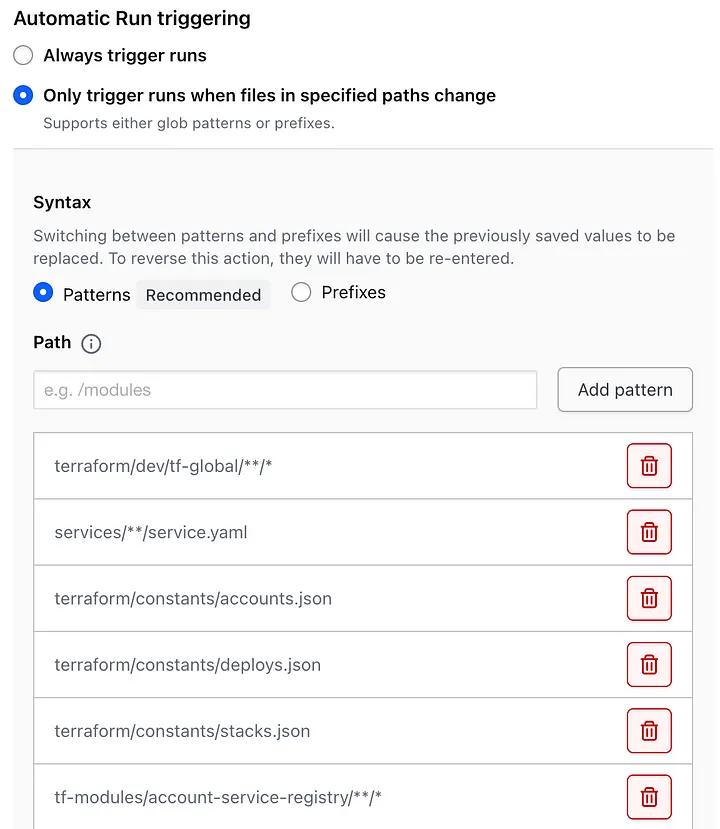

I wrote about how we run Terraform at scale at Benchling. You can read the full article on the [Benchling Engineering blog]({{ page.canonical_url }}){:target="_blank"}.

<a href="{{ page.canonical_url }}" target="_blank"><button>Read the post</button></a>

This article covers:
- How Benchling manages 165k+ cloud resources and hundreds of Terraform workspaces.
- How our infrastructure release automation process slashed developer toil and saves 8,000 developer hours annually.
- How we eliminate infrastructure drift and keep our systems reliably in sync.
- Specific automations and optimizations we've built around Terraform Cloud.

<!-- Managing over 165k cloud resources across hundreds of workspaces could seem daunting. But for us, it’s just another day at Benchling. Here’s how we do it.

We currently have:

- 165k cloud resources under management
- 625 Terraform workspaces
- 38 AWS accounts
- 170 engineers (40 of whom are infra specialists)

We perform:

- 225 infrastructure releases daily (`terraform apply` operations)
- 723 plans daily (`terraform plan` operations)

We’ve been successfully operating Benchling’s infrastructure release system for the past two years (spoiler, it’s Terraform Cloud), over which time we’ve doubled our infrastructure footprint with minimal additional release overhead.

# Before Terraform Cloud: The Chaos

Our infra release process wasn’t always this smooth. Let me rewind and take you back to how it was before.

As is common guidance for small Terraform projects, our team would previously apply all infrastructure changes via laptop. Also in line with common guidance, our team used S3 to store state files, with DynamoDB state locks, which prevented any apply-time collisions. This is a great strategy for a small team working on up to a dozen workspaces. However, this slowly starts to break down as the team’s workspace footprint grows. It’s like the proverbial frog in the pot of water, slowly heated to a boil. By the time we made the switch, Benchling was managing 350 workspaces. We were approaching the boiling point.

## Pain Points: Developer Toil and Inefficiency

Managing 350 workspaces with this approach had several downsides:

1. **Necessitated elevated AWS access** permissions for the infrastructure team.
2. It was **time-consuming** as the engineer had to navigate to each directory, run `terraform apply`, review and approve the run, then verify it succeeded. Very commonly a single change could affect over 120 workspaces, which would mean repeating this process 120 times. (We had developed a custom python script which helped parallelize this somewhat.)
3. **Accumulated infra drift.** Often an engineer would go to apply their change and find numerous unrelated pending infrastructure changes. This situation could arise for many reasons — a previous engineer had missed this workspace while rolling out a change, did not realize an apply step was required, or missed that their apply had failed. The unlucky engineer who encountered this would then need to track down the author of the change which caused this drift, confirm whether this change was intended and safe to apply, and roll out the change. Then they’d have to repeat this process for each of the impacted workspaces.

Applying a single change could easily take a full day, particularly if you encountered unexpected drift (pain point #3). Because of the release overhead associated with an additional workspace, the team was incentivized towards several anti-patterns.

The first anti-pattern was to put as many resources as possible into a single directory/workspace to minimize the number of workspaces that required an apply (thus minimizing pain point #2). This meant some workspaces were managing upwards of 4k resources, which made plan times painstakingly long (30+ min) and increased the blast radius for any change that went poorly.

These excessive plan times for our monster workspaces (pain point #2) and accumulated drift (pain point #3) pushed our team towards a second anti-pattern — using the Terraform `-target` feature. This feature allows a developer to limit changes to a subset of the full infrastructure configuration. While this can be useful in limited circumstances, it functions by only applying changes to a subset of terraform’s acyclic graph (which maps all resource dependencies), so it can cause all sorts of unintended chaos if used indiscriminately. Hashicorp themselves, the authors of Terraform, [strongly discourage](https://developer.hashicorp.com/terraform/cli/commands/plan#resource-targeting) use of the `-target` feature for routine operations due to the possible side effects.

Overall this tooling gap was a source of developer toil and risk. It was clear for an organization at our scale we needed to automate our infrastructure release process.

## Our Solution: Automate Terraform with Terraform Cloud

We evaluated several infrastructure automation tools — specifically Spacelift, Terraform Cloud, and Atlantis. We ended up deciding on Terraform Cloud, mostly for the perceived benefits of working with Hashicorp, who were larger, more established, and authored and owned Terraform.

Successfully rolling out Terraform Cloud required two big changes to our developer workflow. In particular:

1. Move from an “apply then merge” workflow to a “merge then apply” workflow. This was a big source of uncertainty as we rolled out since there is really no way to test for apply-time errors on all workspaces before merging a PR to our main branch.
2. Move to untargeted applies.

We helped ease the pain of this transition with several training sessions, a detailed FAQ, a dedicated Slack channel for questions, and by carefully watching Terraform Cloud for the first few months to ensure no backlogs of releases, erroring runs, etc.

We used an incremental rollout strategy to limit the blast radius, to give our engineering teams time to build familiarity in lower-risk workspaces first, and to learn and adapt our resource capacity planning for Terraform Cloud agents.

## The Impact: Efficiency, Reliability, and Developer Happiness

The resulting impact of this change:

* Eliminated drift (problem #3 above), a huge source of risk and developer toil.
* Roughly **8000 developer hours saved annually** (40 infra specialists × 4 hrs/wk × 50 weeks/yr = 8000 hrs) — that’s equivalent to getting 4 developers back!
* Audit log of every change for a given workspace linked to commit and author. We can’t emphasize enough just how helpful this is for debugging issues.
* Speculative plans — a prospective change can be automatically tested across dozens of impacted workspaces and the results displayed directly in GitHub CI.

*This screenshot shows how we limit speculative plans to a small number of canary workspaces (in this case just one).*

In the time since we initially rolled out Terraform Cloud two years ago, we’ve continued to refine and improve this system in many ways both big and small.

# How We Run Terraform Cloud Today

We host our own installation of Terraform Cloud with our TFC agents running in our own AWS account. (Hashicorp calls this product Terraform Cloud for Business.) We prefer to keep all admin access to production infrastructure in-house without conferring any production permissions to Hashicorp. We run these Terraform Cloud agents in our own ECS cluster. Our contract allows us to run up to 200 concurrent agents, though we typically run 120 across two agent pools (40 in our dev pool and 80 in our prod pool). This allows us to release changes to our 625 workspaces with high concurrency. For example, if a single change impacted 80 workspaces, it can be applied to all 80 workspaces simultaneously.

## The Things We Monitor Obsessively

1. **Agent exhaustion / concurrency limits:** If there are no available agents for a sustained period, we page our on-call (we intend to implement autoscaling one day).
2. **Plan time:** If plan time exceeds 4 min in dev, we notify our team. We care most about ensuring quick plan times in dev workspaces since this reduces developer feedback loops during infra development.
3. **Infra drift:** After a year of measuring minimal drift, we eventually stopped measuring this because drift doesn’t meaningfully exist in our infrastructure anymore. Since 1) all applies are untargeted, 2) zero engineers have prod write access by default, 3) releases are so frequent that any drift is quickly addressed by the next release.

## Quality of Life Optimizations

Although Terraform Cloud has been a great tool for us, as a large-footprint organization and power-user, we’ve found it lacks some features we need. Here are the custom features we’ve built around it.

### TFC CLI

Some of our Terraform modules are used across many many workspaces. For example we have 261 workspaces affected by changes to our “deploy” module. Any change that impacts this module requires 261 reviews and approvals, even though the actual changes are substantively the same. Clicking through the Terraform Cloud UI is tedious, so we wrote a CLI. Our tool lets us run `tfc apply --commit abcd1234` to review plans and apply changes. A more sophisticated invocation might look like `tfc review --commit abcd1234 --wildcard update:module.stack.*.access_controls --include-tag type:deploy`. This command auto-approves changes that match the specific commit SHA, the wildcard resource address, and the provided label/tag.

We’ve added several other features over time, but the commands that get the most heavy use are `tfc run` (trigger new plans), and `tfc review` (review and approve pending applies).

### Notifications

Because we require manual review and approval for each production change, a developer can easily merge their change and then forget to apply it. We built a Slack notifier service to solve this problem. It runs every 10 minutes and notifies the commit author of any pending Terraform Cloud applies. It only runs during business hours and does an exponential backoff so as to not be too annoying.

### Workspace Managers

We have 625 workspaces, so of course we manage our Terraform workspaces with Terraform! We make heavy use of the [tfe provider](https://registry.terraform.io/providers/hashicorp/tfe/latest/docs). We built a `tfc-workspace` module which we use to provision each workspace.

### Ownership Delegation

Our team owns Terraform Cloud as a service provided to our infra, security, and developer teams. We try to keep these workspaces in a non-errored state, with providers updated monthly, and any deprecation warnings addressed promptly. However some workspaces manage resources outside our team’s expertise, at which time we need to delegate to the appropriate team to address these issues. To solve this we’ve developed a convention of applying tags to each workspace with tags like `owner:{github_team_name}`, for example `owner:infra-monolith` or `owner:security-eng`. This allows us to notify the appropriate team when an issue with the workspace arises.

*Here’s an example of how we tag workspaces today. We apply these via our `tfc-workspace` terraform module to keep naming consistent.*

### TFC Usage Reporting

Lately, our Terraform Cloud contract has come up for renewal, which means we need to predict future growth and usage. Unfortunately, Terraform Cloud only tells you total Resources Under Management at the current point in time, but nothing else.

To this end we built a script that uses the TFC API to query each state version for each workspace, going back a year, and tabulates this data into a CSV, after which we build some charts. These charts allow us to track growth by provider resource type (e.g. `aws_s3_bucket`, `aws_ec2_instance`), workspace type (e.g. `type:region`), or AWS account. Ick, but it works.

### TFC State Backup

We need a disaster recovery strategy in case Terraform Cloud is down. During a disaster recovery incident we can revert to `local` mode, if approved to do so, utilizing break-glass functionality and processes. However, the one gap here is we need access to the state file, which is stored in Terraform Cloud. To protect against a loss of the state file, we’ve implemented a flavor of [this post](https://dev.to/mnsanfilippo/how-to-backup-the-terraform-states-from-terraform-cloud-workspaces-1km4) to back them up to an S3 bucket after each apply.

*Here’s an example of our state backup webhook. Upon completion of a `terraform apply`, it triggers a lambda which copies the terraform state file from Terraform Cloud to a secondary location in S3 which we can use in a disaster recovery event.*

### Workspace Dependency Map

One great thing about Terraform Cloud is it allows you to have a given workspace watch certain repository directories for changes. For example, a workspace can watch for changes to the `tf-modules/*` and trigger plans if anything in that directory changes. However, this doesn’t work very well at our size because we both use a monorepo and also have 180+ modules with 625 workspaces each using some subset of those modules. (For example, if all 625 workspaces tracked `tf-modules/*` and a single file was changed in that directory, then it would trigger 625 runs, quickly exhausting our agent pool of 120 agents, even if most workspaces resulted in a no-op.) Thus, we built a custom tool that maps out the module dependency tree for each workspace and generates a yaml configuration which is read by our tfc-workspace module to determine which directories to watch.

*This shows the directories we track for one example workspace.*

### Provider Upgrades With Dependabot

With 625 workspaces, each using an average of 3 providers, that’s 1875 unique provider-workspace upgrades to perform. We use Dependabot to help with this, upgrading all providers on a monthly cadence.

Even managing Dependabot at this scale takes some work, so we’ve built automation that allows us fine-grained manipulation of the `dependabot.yml` file. This enables us to allow-list certain providers for upgrade, deny-list other providers, isolate upgrades to just dev or prod workspaces, or treat individual workspaces with special conditions. Here’s a [gist that shows how our `dependabot.yml` is structured](https://gist.github.com/cmonaghan/7e714071a1c4be1026f01ab3efb1b8dd). Fully-generated for all workspaces, this file runs to 2000+ lines of yaml.

## Ongoing Improvements: Optimizing for Scale
Our infra release system is still a work in progress. It’s not perfect, but we continue to make improvements every day. Here’s where we’d love to take it next:

### Staged Rollouts

We currently use a `main` branch. Once merged to `main`, it gets released to most workspaces (our validated customers, or GxP customers, are an exception as they only receive quarterly releases). We’d like to move to staged rollouts with more release tiers (e.g. `dev`, `staging`, `prod`, `gxp`). We would verify success across the tier before promoting to the next tier.

### Decompose Large Workspaces Into Many Smaller Workspaces

Although we’ve grown from 350 to 625 workspaces, we still have numerous workspaces managing thousands of Terraform resources. This makes plan and apply operations slow to complete. Since rolling out changes to all workspaces is now fully automated now, we should lean into decomposing these workspaces further, breaking these 625 workspaces into 1500+ workspaces to reduce plan and apply time and to minimize blast radius.

### Enhanced Notifications

The ability to reassign Slack notifications to other users has been a popular feature request. Also, it’d be nice if the Slack bot prepared a `tfc review` command scoped to just the impacted workspaces.

### Agent Autoscaling

Auto scaling this kind of workload is complicated and Hashicorp supports an EKS Operator to do just that. We hope to migrate our agent pool to EKS to employ the supported pattern.

### Open-Source

We’ve built a lot of custom tooling to support our infrastructure automation. Most of it solves use cases we imagine many other teams have, so we’d love to open-source this work.

# It Takes a Village

This system was built by many hands, thanks to the collaboration and insights of many engineers across Benchling. Our deep gratitude to all those Benchlings who have been partners in helping us get to where our infrastructure story is today!

We hope this post proves helpful to you and your organization in designing your cloud infrastructure for scale. -->
