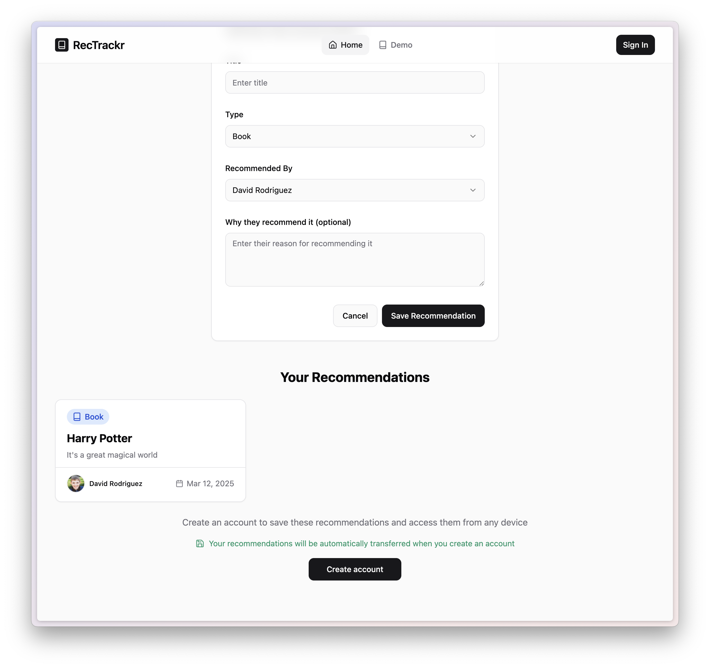

The recommendation tracker project is coming along nicely. It's almost ready for some beta testers!

I ensured unauthenticated users can experiment with the app in demo mode, and that those same features correctly persist data to Supabase when logged in.

Here are some screenshots of the current state:

*Landing page*

*Add first recommendations*

*See all recommendations*
