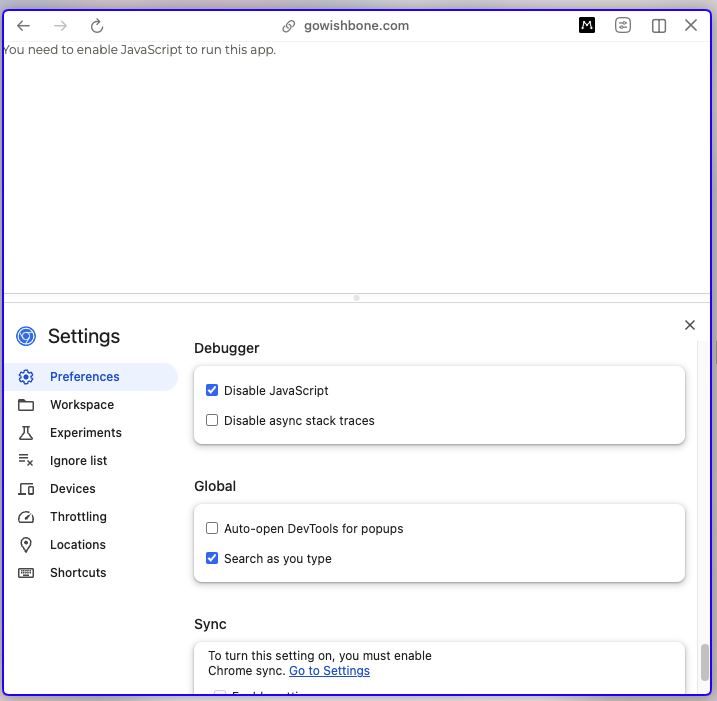
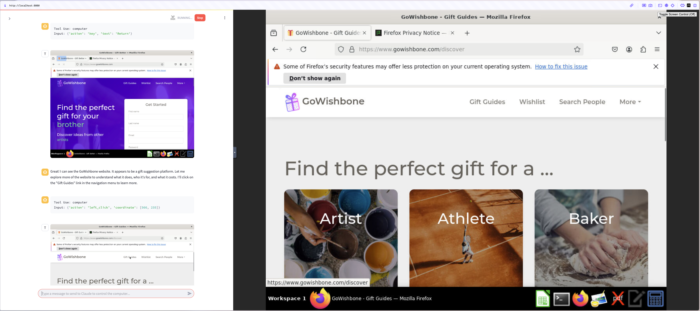
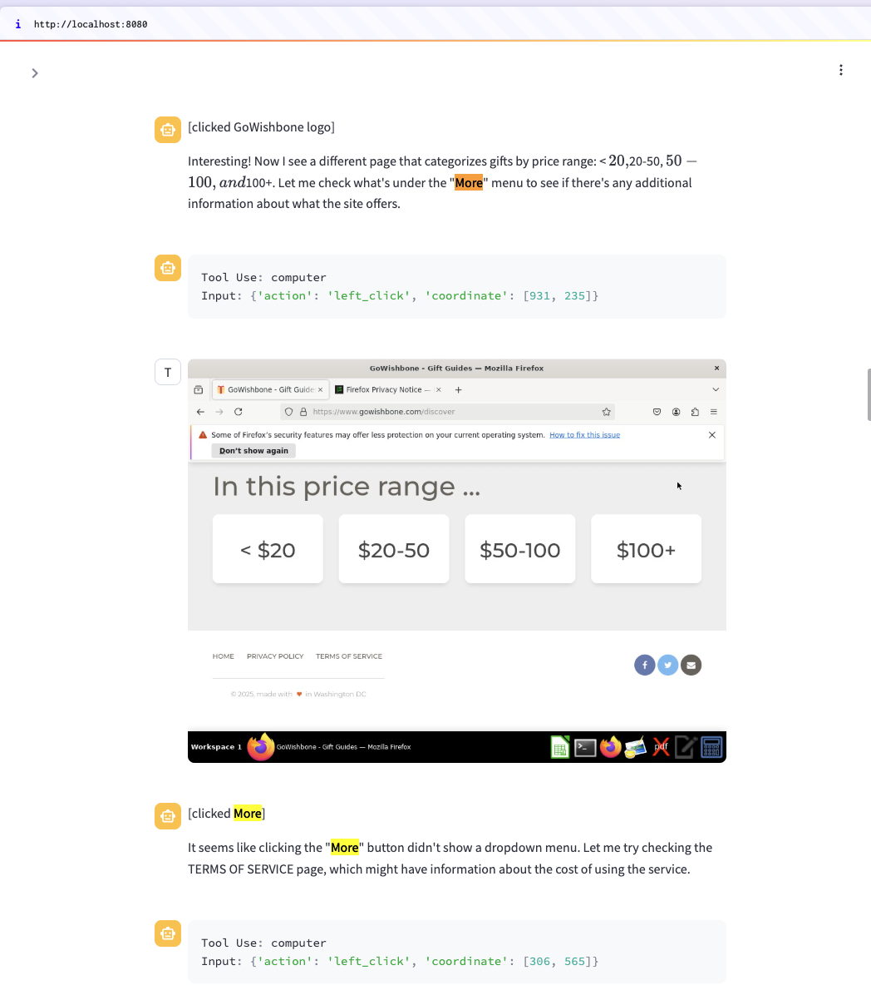
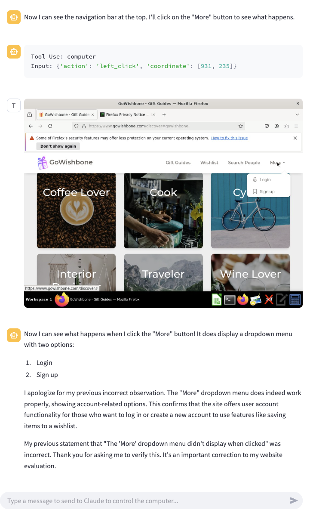

When I've built web applications in the past, user testing is one of the hardest parts to scale. Historically it's involved partnering with a user research firm, or taking a DIY approach and finding user testers on craigslist, scheduling 30 min, and paying the participants for their time. In both cases it takes a lot of time and a lot of money. 

It can also be challenging to find a representative sample of your user base. For example if you're building a product for C-Suite execs, it's quite a challenge to find people of this demographic willing to sit down and click through your application to discover confusing elements.

**Can we build LLM user personas who could test products at scale?** Let's find out.

I think there are two levels of an LLM-as-persona assessment:
1. Read-only assessment --- answer questions like: What is the value proposition? What does it cost? Who is this product for?
2. Interactive assessment --- discover usability like: How do you decide which first action to take? Can you create an item? Can you discover how to do X action?

### Read-only assessment

A read-only assessment is easier to do, as any LLM with web-browsing capabilities and a little guidance should be able to do this. Let's start by pointing an LLM with web browsing capabilities at an existing app of mine.

Let's have an LLM assess [GoWishbone](https://www.gowishbone.com/).

LLM Prompt:
>You are a user tester for new web applications. For each testing session, you are given a user persona to emulate, a link to a web application to test, and several questions to answer as your persona would likely answer. For this test, your persona is that of a 65-year-old woman who has been sent a link by her daughter: https://www.gowishbone.com/. Can you explore this web application (without entering or submitting any data) and answer the following questions: What does this site do? Who is it for? What does it cost? If you follow a link say "[clicked {link_title}]" so the web application designer can follow along and understand which page you are exploring. Describe your thinking out loud so the web application designer can follow along.

##### Open AI: ChatGPT

I get some mildly useful feedback. The LLM is able to accurately describe the value proposition and flags a gap regarding "lack of upfront information about costs." 

It also flags "The homepage mentions the need to enable JavaScript to run the app, which could be a barrier for users unfamiliar with adjusting browser settings." It's funny the LLM called this out because this seems to be an artifact of how ChatGPT conducts web browsing. As is common practice, we display html text that says "javascript must be enabled" in the event that javascript is disabled, but this would never be displayed in most cases, since most browsers have javascript on by default.

*Javascipt must be enabled warning*

ChatGPT also doesn't seem to click any links as instructed. I had to subsequently prompt it with "Can you follow the link that says "Gift Guides" and describe what this page does?"

Overall, I'd consider this feedback moderately useful, but nothing earth-shattering. It's also problematic that ChatGPT's approach to web browsing does not seem to be a close representation of how a human user would interact with the site (as evidenced by how it calls out javascript must be enabled).

##### Anthropic: Claude (Computer Use)

I setup a [docker container using the Anthropic API](https://github.com/anthropics/anthropic-quickstarts/tree/main/computer-use-demo#anthropic-api), and submitted the same prompt above.

*Claude (Computer Use) testing GoWishbone*

The LLM clicked around the site. Regular screenshots helped me understand what exactly the LLM was seeing. It navigated through the Home page, "Gift Guides," and "Terms of Service." This is a rather odd subset of the website to browse. It may have gone on to explore the other pages, but it started looping on the "Gift Guides" page where it would get to the bottom of the page, favorite an item, then a modal would pop up to create an account, and it would exit the modal and start over. It did this 3 times before I interrupted it and asked it to summarize its findings.

LLM Prompt:
>Great job! Can you summarize your findings along with any targeted suggestions for the web designer?

Total cost: $0.45. Compared to a $50 payment to a research participant, that's very reasonable!

It clearly understood the value proposition. 
It even made an insightful guess to justify its assumption that the cost of this service was probably free: "The site likely makes money through affiliate links when users purchase recommended items."

It actually produced a very detailed list of targeted suggestions! 

--

Suggestions for the Web Designer
1. Improve Navigation:
* The HOME link didn't work consistently when clicked
* The "More" dropdown menu didn't display when clicked

2. Streamline Account Creation:
* The popup to create an account appeared multiple times and was difficult to close
* Consider a less intrusive way to encourage account creation

3. Enhance First-Time User Experience:
* Add a brief tutorial or introduction explaining how the site works
* Make it clearer that creating an account is optional for browsing

4. Increase Transparency:
* Clarify if these are affiliate links that earn the site commission
* Add information about how gift recommendations are curated

5. Improve Mobile Responsiveness:
* While testing on a desktop, I noticed potential issues with layout that could affect mobile users
* Add Gift Reviews/Ratings:

6. Include user reviews or ratings for gift suggestions to build trust
* Show how many people have added an item to their wishlist
* Create a FAQ Section:

7. Address common questions about how the service works
* Explain the wishlist sharing feature more clearly
* Add Search Functionality:

8. Implement a search bar to find gifts by keyword
* Allow filtering by multiple criteria (interest + price range)

--

Most of these suggestions are good ones.

This actually discovered a real bug I was unaware of---the "Home" link in the footer doesn't appear to work.

It doesn't seem to actually make use of its persona much.
Maybe we need to improve our prompt here to get it to actually behave more like that persona.

I didn't quite understand what it meant by 'The "More" dropdown menu didn't display when clicked' so I asked it to clarify.
Unfortunately it didn't remember what it had seen and could only offer some possible reasons for the discrepancy.

When scrolling up to see the history of its actions, we can see the "More" button was never displayed:

*Claude "More" button doesn't display*

The available screenshot shows the LLM was scrolled down to the bottom of the page where this nav button was out of view, so I'm not quite sure how it would have clicked it anyway.
Or maybe the screenshot wasn't taken at the right time to capture what it was seeing.

Let's explicitly ask it to try scroll to the top of the page and click the "More" menu.

*Claude "More" button displays on retry*

It seems to work, once I prompt it again.

Overall, Claude computer use is far superior and much closer to a real human user than whatever method of web browsing ChatGPT is using.
It suggested some genuine improvements.

### Conclusion

User testing via LLM's seems very promising and worth exploring further.
It may not offer the same nuance as working with a human user, but it's quick to spin up and 100x more cost-effective.
Mimicking a human user's experience as closely as possible seems essential (e.g. Anthropic Claude Computer Use).
We still need to discover how to actually get the LLM to observe its persona.

Ideas for enhancements:
* Have the LLM create a github issue for each feature suggestion
* Generate unit tests for any bugs discovered
* Allow the web developer to see results from multiple personas at once
