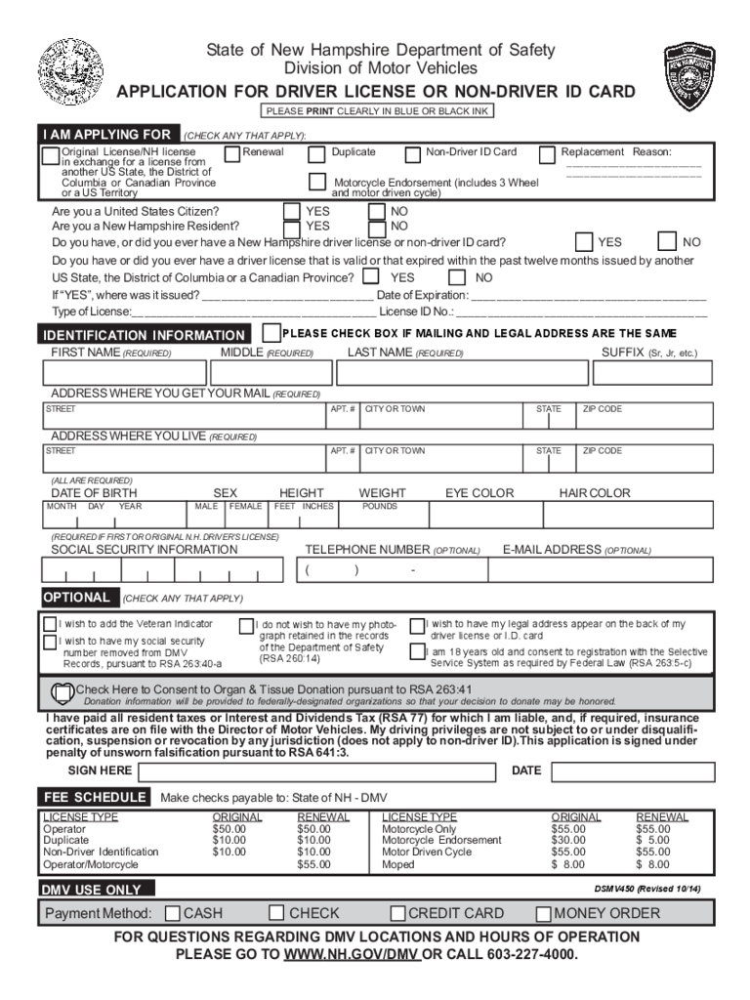
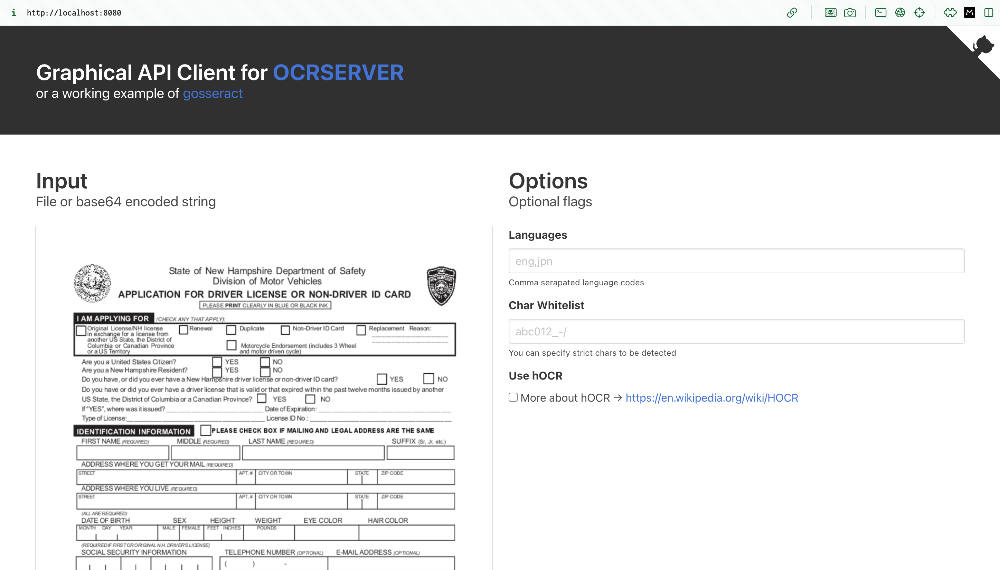

An idea I've wanted to explore is how to turn a paper form into an API. The basics would be to take a photo of the form, use OCR to extract the field names, and create a data schema from this. A web endpoint could then be created that can handle future submissions for this form schema and save them to a database. 

Then when subsequent forms of the same type are submitted, it would automatically extract the form data (which could be handwritten), present the OCR results to the user for any corrections, and submit to the existing web endpoint, saving this to the database.

I think there's also an interesting use case to provide the opposite tranformation---use an API to convert database information into a paper form (or digital PDF). Why would you ever want to do that? The use case here would be for submitting to organizations that still require paper (or digital PDF) form submissions (such as a doctors office filing health insurance claims).

I have no prior experience with OCR technologies, but let's see what they can do. Continuing with my interest in Golang, I found an OCR server using tesseract written in go that I can run locally ([https://github.com/otiai10/ocrserver](https://github.com/otiai10/ocrserver)) and I ran this with:

```
docker run -p 8080:8080 otiai10/ocrserver
```

I searched for a good example form and found a drivers license application for New Hampshire.



I uploaded this to my local OCR server:



Here's the OCR result. It seems to be about equal parts accurate, and equal parts jibberish. Here's what it reads:

```
SER, State of New Hampshire Department of Safety (mea)
Ee He tr a=
fake) Division of Motor Vehicles lesa
Ne APPLICATION FOR DRIVER LICENSE OR NON-DRIVER ID CARD \\Wy/
S
Ne 20 wy ar arog
Original LicenseiNH license Renewal Duptoate Naw DiverID Card [=] Replacement Reason
Cement, Oe Ooo o-=
Saumnbia of Ganaden Brovece 1 ictrcyie Endorsement (cludes 3 Whee!
ras Tero andmolor ven cyl)

‘Are youa United States Citizen? LJ ves NO

‘AreyouaNew Hampshire Resident? [\u003e] YES No

Doyouteve,orddyousver have a New Halthieeiverlobde or nor-ctver I cart? Ores [no

Do you have or did you ever have a driver license that is validor that expired within the past twelve months issued by another

US State, the District of Columbia or a Canadian Province? L] ves  [[] no

IFYES\" wherewasitissued? ate of Expiration:

Type ofLicense:_ “License ID No —
eM enue |_|PLEASE CHECK BOX IF MAILING AND LEGAL ADDRESS ARE THE SAME

FIRST NAME require) MIDDLE pcquney LAST NAME cour SUFFIX (6 te)

\"ADDRESS WHERE YOUGET YOURMAIL reoureo)

\"ADDRESS WHERE YOULIVE eau,

LAE REOURED,

DATE OF BIRTH SEX___HEIGHT __WEIGHT_EYE COLOR HAIRCOLOR

TREGUREDE ARSTORORGNALNA DRVERSUGENSE)

SOCIAL SECURITY INFORMATION TELEPHONE NUMBER ornowa) _ E-MAIL ADDRESS ornoway
foiti tii iJ oT
omen nr rar
[i wisnts ass tme veeraninacatr [Ji co rat wan tonavemy prot L_} wish have my legal aozress appear on Be back my
IE! wt nave my socal serny graph retaned inte rcrse LA ger icense or.0 card

umber removed trom DMV ofthe Department of Safety [am 18 years old and consent to registration with the Selective
Records, pursuant to RSA 263.40. (RSA 26014) Service System as required by Federal Law (RSA 263:5-c)
Chee Here © Consent to Organ \u0026 Tissue Donation pursuant to RSA 263341
‘Donan fomaton wi be protded 1 odemly-dosraled etgarzatns 5 hat Your decison fo donate may bo honored
fave pad all resident taxes or Interest and Dividends Tax (RSA?) for which Tam Table, and, # required, Insurance
cerlficates are on file with the Director of Motor Vehicles. My driving privileges are not subject to or under disqualif-
ation, suspension oF revocation by any jurisdiction (does not apply te non-driver ID). This application is signed Under
penalty of unsworn falsification pursuant to RSA 641:3.
seunere |e \u003e
GEESE Make checks payable to: State of NH -OMV
TIGENSE TYPE CRGNAL RENEWAL] TCENSETIBE CRGNAL RENEWAL
Operator $50.00 $50.00 Motoreyle Oni $55.00 $55.00
Duplicate $10.00 $1000 Motoreyete Endorsement $30.00 §°500
Non-Driver Identification $10.00 $10.00 Motor Diven yee. $55.00 $55.00
OperaterMotoreyce $55.00 Moped $8.00 $8.00
PINaMeT ten Dsuwaso Revised 1016)
Payment Method: [_]CASH (CHECK CIcREDIT CARD (MONEY ORDER
FOR QUESTIONS REGARDING DMV LOCATIONS AND HOURS OF OPERATION
PLEASE GO TO WWW,NH.GOV/DMV OR CALL 603-227-4000.
```

I wonder if AWS Textract can do any better?
