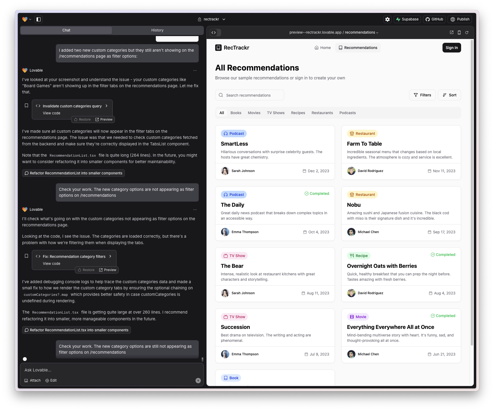
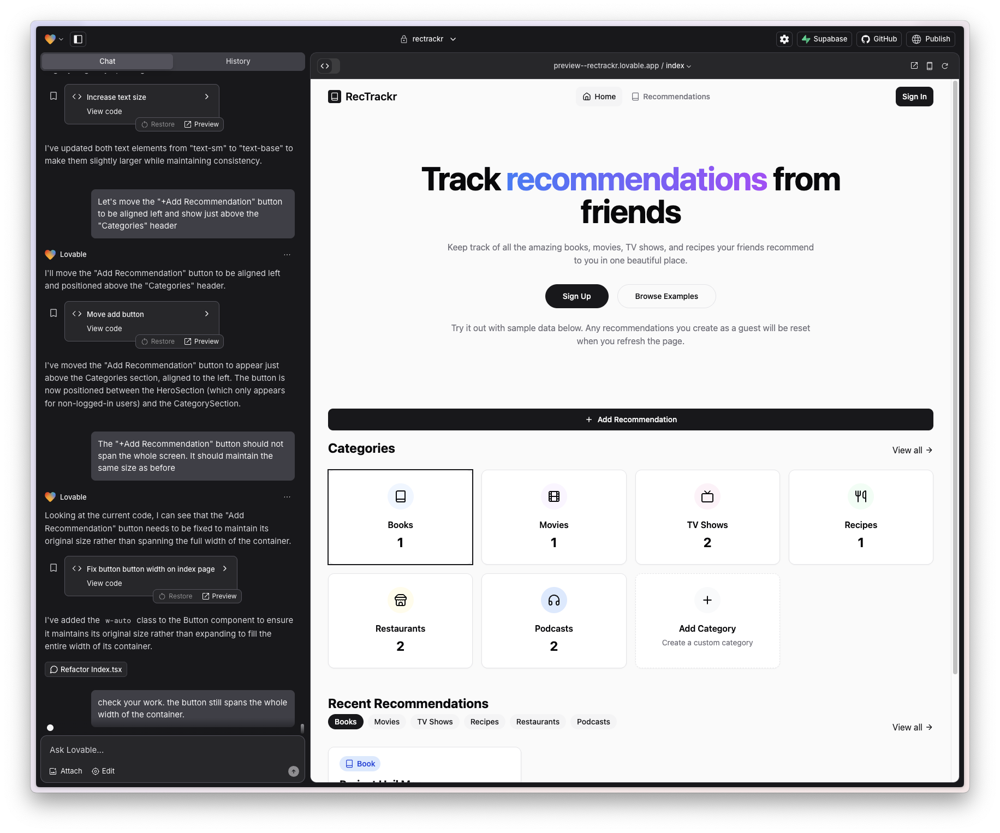
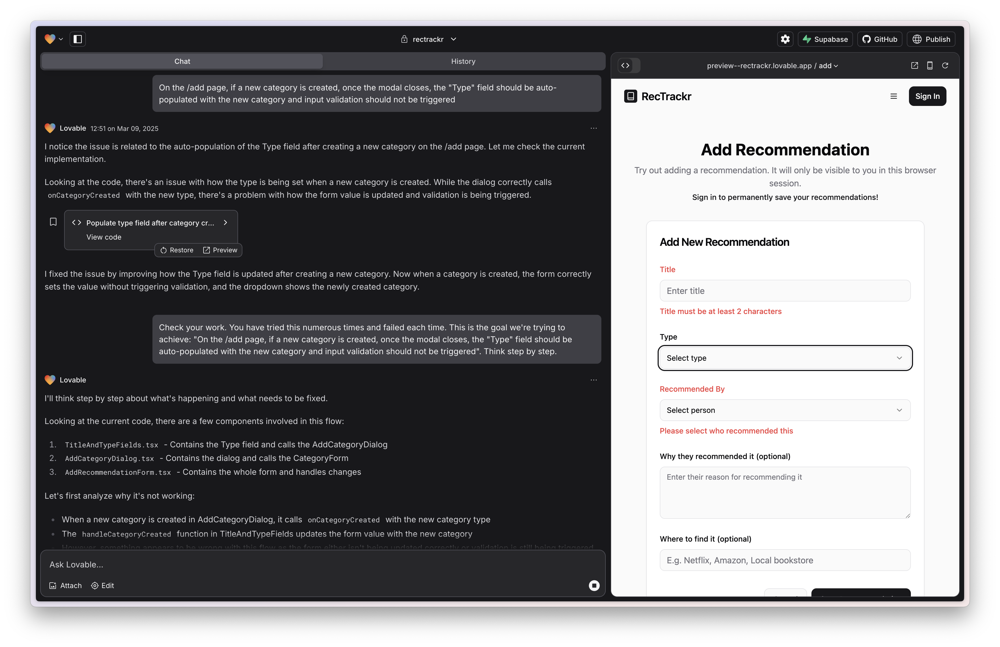

I continued working on my recommendation tracker app using Lovable.

It seems very effective at going from idea to MVP in a short amount of time. It implements reasonable defaults and sound designs where the prompt is vague. 

However, as I continue to add specific features, often with a much closer eye to the intended visual effect or functionality, it seems to struggle more. Here are two examples:

*Lovable requires several prompts to perform a simple change.*

*Lovable requires several prompts to perform a simple change.*

Here's an example feature that it was never able to complete despite 6 attempts using slightly different prompts.

*The agent was never able to add this feature despite numerous attempts.*

It struggles enough in some cases that I feel like developing the desired feature traditionally would be more successful and require less time. Maybe the ideal development flow is to try to build it in Lovable, but if it fails after 3 attempts, switch over to your IDE and build the feature there.
