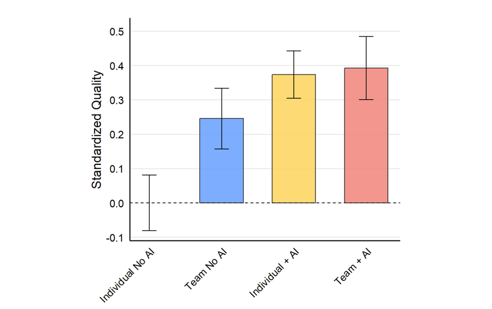

Time for a new project! 

Today I've decided to try something less about coding, and more about deep thinking and ideation. 

I'm interested in emergent new opportunities for AI to solve problems that were previously intractable due to the high cost of human labor. For example, each of these are impracticle at scale because they are too time-intensive for humans: 
* content moderation
* qualitative user surveys
* respond to all user feedback
* personal assistants
* build custom personal software
* skip customer service phone tree and talk to an empowered agent
* design custom clothing

Let's see what new areas we can explore with OpenAI's ChatGPT 4.5 Deep Research.

### My Prompt
> I'm an entrepreneur who is exploring new business opportunities that will now be possible with AI. In particular, I'd like to explore use cases and ideas that have never been addressed before because human labor is too expensive. Some example of this might be: respond to all user feedback, qualitative user surveys, content moderation, personal assistants, build custom personal software, skip customer service phone tree and talk to an empowered agent, design custom clothing, every industry where good software is lacking, etc. Can you help me by thinking carefully, and coming up with 40 problem spaces that were never addressed before, but now could be with AI?

### Response

Here are 40 carefully considered problem spaces and business opportunities that were previously impractical due to high human labor costs but could now become viable with AI:

##### Customer Interactions

1) Proactive Customer Care: AI that monitors customer interactions across platforms to proactively address issues before they escalate.

2) Fully Personalized Onboarding: Tailored product onboarding experiences generated in real-time for each user.

3) Micro-feedback Analysis: Deep analysis of small feedback fragments to detect customer sentiment trends.

4) Instant Warranty Management: AI-driven warranty claims processing and approvals without human intervention.

##### Healthcare

5) Continuous Mental Health Support: Always-available conversational AI therapist for immediate emotional support.

6) Personalized Health Tracking: Real-time health monitoring with personalized advice based on continuous data streams.

7) Rare Condition Diagnostics: AI systems reviewing vast medical literature to identify extremely rare diseases instantly.

8) Proactive Elderly Care Monitoring: AI-driven home monitoring for elderly populations, identifying subtle behavior changes before they become emergencies.

##### Education

9) Real-Time Adaptive Curriculum: AI continuously adjusts teaching materials to match each student's learning speed and style.

10) Detailed Essay Feedback: AI providing nuanced, personalized feedback on written assignments at scale.

11) Holistic Career Coaching: AI-driven career coaching tailored to individual skills, personality, and market trends.

##### Content and Media

12) Hyper-local News Reporting: Automatically generating hyper-local news stories from social media, government data, and local announcements.

13) Instant Fact-checking: Real-time AI verification of public statements and news articles at scale.

14) Personalized Documentaries: AI-generated documentaries tailored to the viewer’s unique interests.

##### Financial Services

15) Continuous Financial Guidance: Constant, proactive AI guidance adjusting to users’ financial goals and market conditions.

16) Micro-Loan Risk Assessment: Precise AI-powered risk assessments enabling micro-loans at scale with minimal overhead.

17) Instant Contract Review: AI reviewing and redlining contracts in real-time.

##### Entertainment and Leisure

18) Personalized Game Creation: AI-generated games tailored uniquely to each user's preferences and play style.

19) AI-Driven Travel Planning: Fully personalized travel plans, adjusted dynamically in real-time during a trip.

20) Custom Entertainment Scripting: AI writing scripts or plots tailored exactly to individual user interests and preferences.

##### Personal Services

21) AI Household Inventory Manager: Automated management and replenishment of household items before they run out.

22) Personalized Wardrobe Management: AI-driven wardrobe curation and daily outfit recommendations based on weather, occasion, and mood.

23) Micro-personalization of Diets: AI precisely customizing meal planning and grocery lists at scale.

##### Software and Automation

24) Custom Internal Company Tools: Automatic creation of tailored internal software tools based on business operations and workflows.

25) AI-Enhanced Code Review: Continuous code reviews by AI with real-time feedback for developers.

26) Fully Automated Technical Writing: AI generating comprehensive technical documentation based solely on codebases.

##### Creative Industries

27) Personalized Marketing Videos: AI-generated video ads tailored individually to consumer preferences and histories.

28) Custom Event Planning: Fully automated AI-driven event organization, customized down to every attendee’s personal tastes.

29) Automated Art Commissions: AI that creates and refines custom art or illustration commissions instantly at scale.

##### Retail and E-commerce

30) Personalized Gift Selection: AI deeply understanding relationships and events to select ideal, personalized gifts.

31) AI-powered Product Design Feedback: Instant, detailed consumer feedback on new product prototypes.

##### Legal and Compliance

32) Instant Regulatory Updates: AI that monitors global regulatory changes, proactively alerting and updating companies.

33) Automated Legal Advice: AI-driven, nuanced legal advice for small businesses and individuals at scale.

##### Real Estate

34) Fully Automated Property Management: AI managing routine property operations, tenant communications, and maintenance requests.

35) Predictive Urban Planning: AI analyzing real-time urban data to recommend infrastructure improvements.

##### Agriculture

36) Precision Small-scale Farming: AI-powered personalized farming plans for small farmers, maximizing yield and minimizing resources.

37) Automated Pest Identification: Instant identification and management of pests through AI-driven visual analysis.

##### Human Resources

38) Continuous Employee Engagement Monitoring: AI proactively identifying subtle shifts in employee sentiment and recommending targeted interventions.

39) Personalized Training at Scale: Automated creation of custom employee training tailored to individual skill gaps and strengths.

##### Environmental and Social Impact

40) AI-driven Community Support: Automated identification and support of vulnerable community members, proactively deploying aid and resources based on real-time signals.

Each of these ideas leverages the strengths of AI to unlock value and efficiency previously unattainable due to the prohibitive costs and complexity associated with human labor.

### Digging in

Impressive. Many of these are reasonable ideas. Though some of them are a bit vague and may not be practical to implement. The one that jumped out at me (because it addressed a problem I myself have) is "31. AI-powered Product Design Feedback: Instant, detailed consumer feedback on new product prototypes."

I'm curious to dig into that further, but before I do, let's first see if we can generate another 40 ideas so that we have 80 total, then winnow the list down based on size of the market, competitive landscape, and match to my own skills.

I'll spare you the full answers, but there are a few answers just sound like AI bullshitting:
* "Continuous AI-powered Employee Engagement Monitoring. Why? Large enterprise HR tech market; applicable to any organization above mid-size. Your web/cloud expertise is ideal for real-time, cloud-based analytics dashboards." - "cloud-based analytics dashboards" is just a jumble of buzzwords with no substantive meaning.
* "Multi-tenant AI Compliance Assistant. What: AI-driven SaaS assisting companies with continuous compliance monitoring and audits for frameworks like SOC 2, GDPR, HIPAA, etc." - What's multi-tenant about this?

I then dug further into idea 31. It provided helpful guidance in assessing the idea. It also pointed me at 6 other competitors in the space. ChatGPT provided a summary of each competitor's value proposition, plus I also scoped out each of their webpages myself. None of them seem to do exactly what I envision here, which is to have an AI agent actually interact with a webpage and flag anything that is confusing, missing features, etc.

### Conclusion

This was a helpful research assistant that pushed me to think of additional ideas and generally augmented my own thought process. It felt like I was working with a teammate, and together we could come up with better solutions. This made me think of Ethan Mollick's recent post [The Cybernetic Teammate](https://www.oneusefulthing.org/p/the-cybernetic-teammate) where individuals *with* AI performed better than teams *without* AI.

*Individuals with AI outperform teams without AI. Image credit to Ethan Mollick.*

This certainly seems to be the case in my experience today.

(Note that Ethan's post also goes on to show that for the top 10% of ideas, teams did perform better than individuals, both with and without AI; human teams do still add considerable value.)
