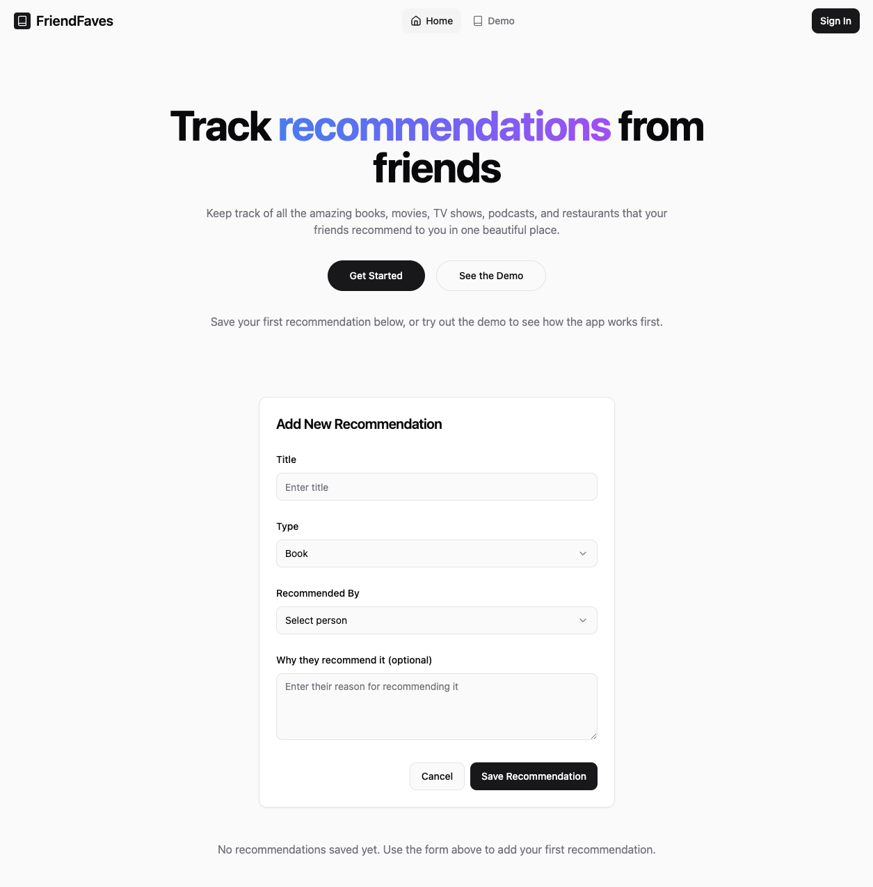
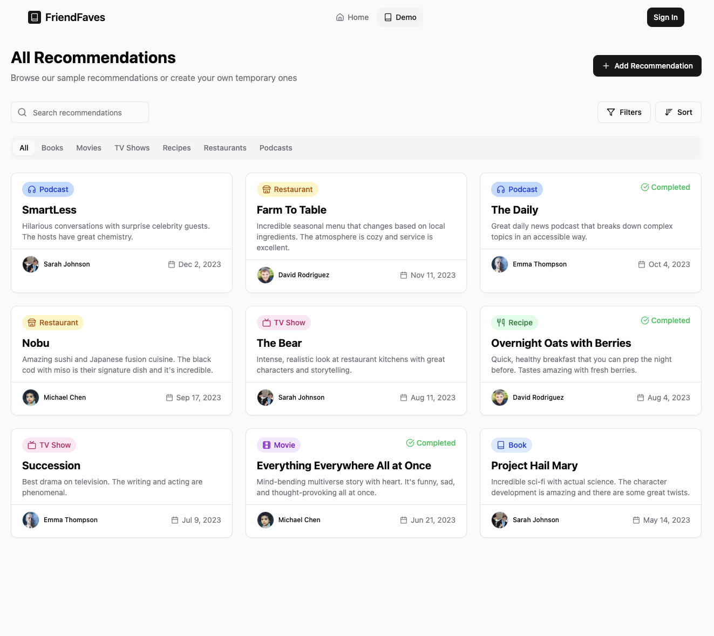
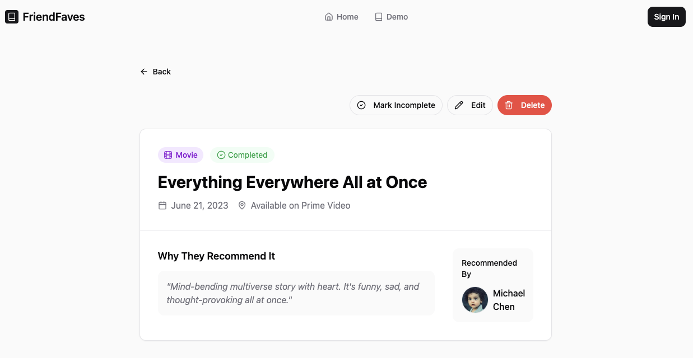
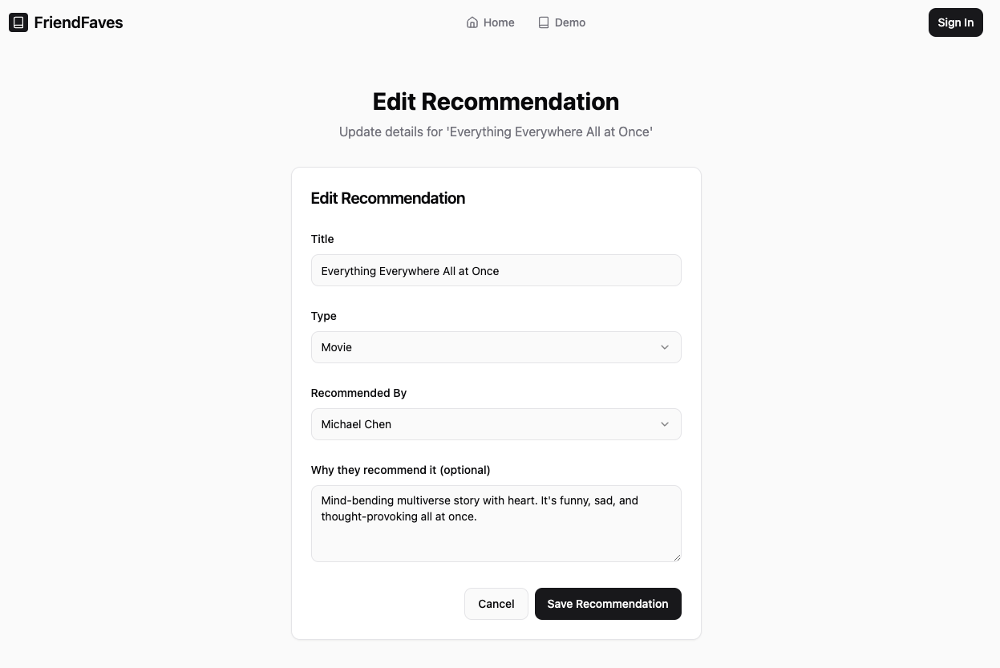
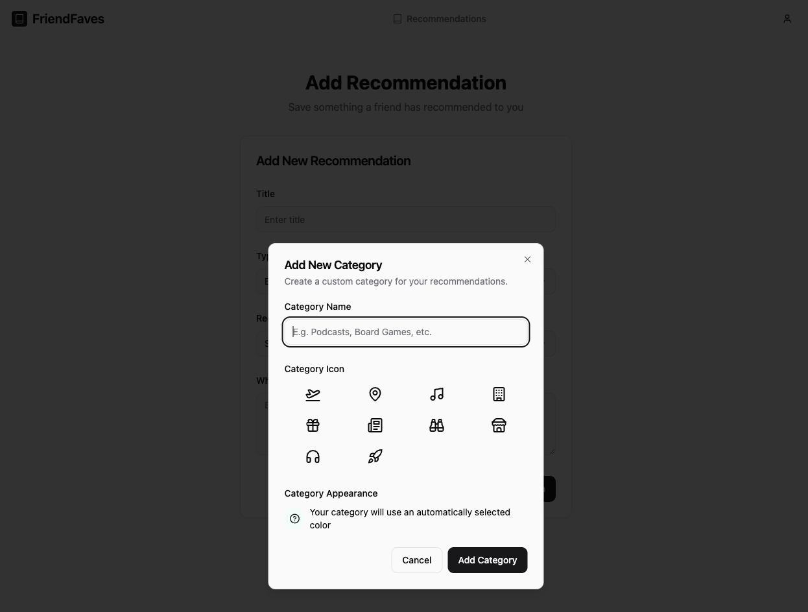

### Landing Page

*FriendFaves landing page for unauthenticated users*

### Demo Page

*FriendFaves demo page for unauthenticated users*

### Recommendation Card

*FriendFaves recommendation card*

### Edit Recommendation Card

*FriendFaves edit recommendation*

### Add Category

*FriendFaves add category modal*
