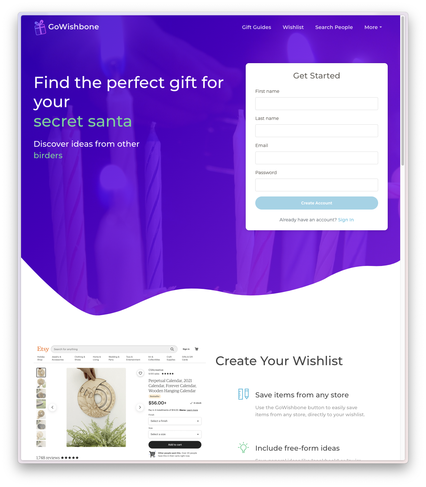
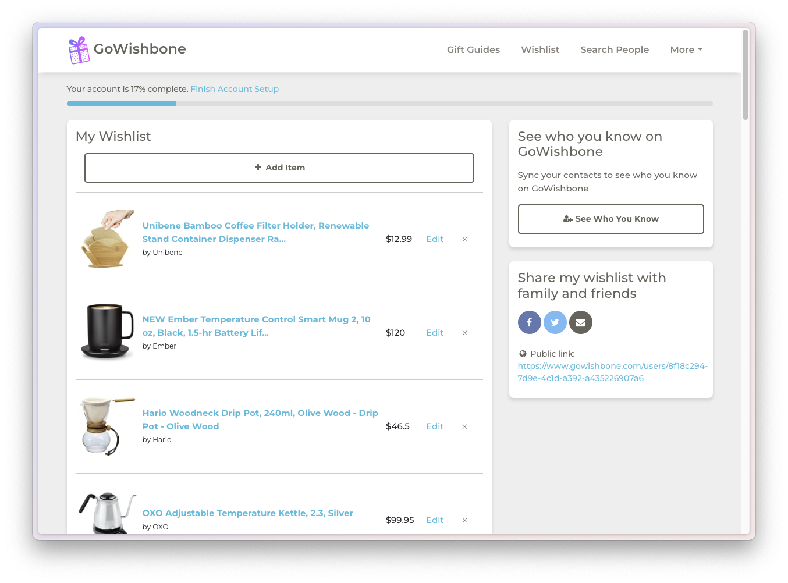
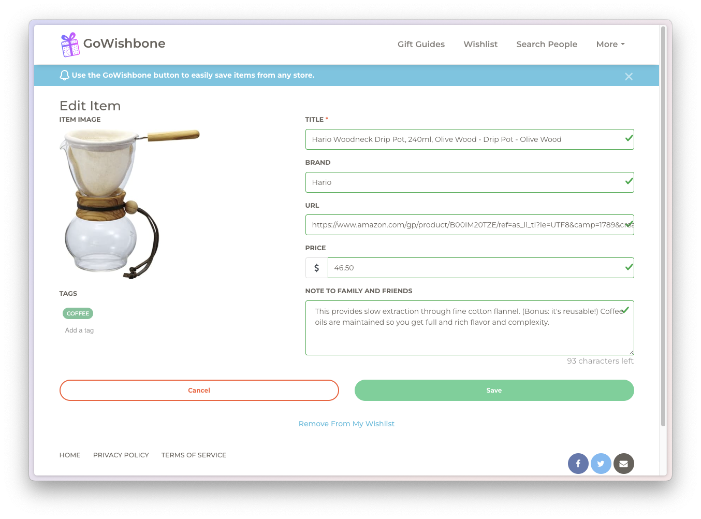
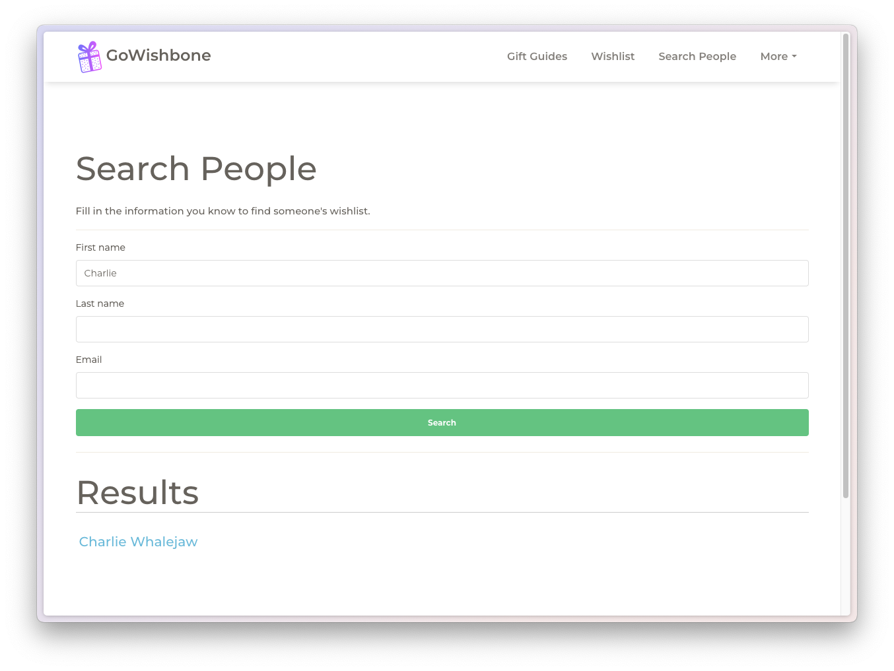
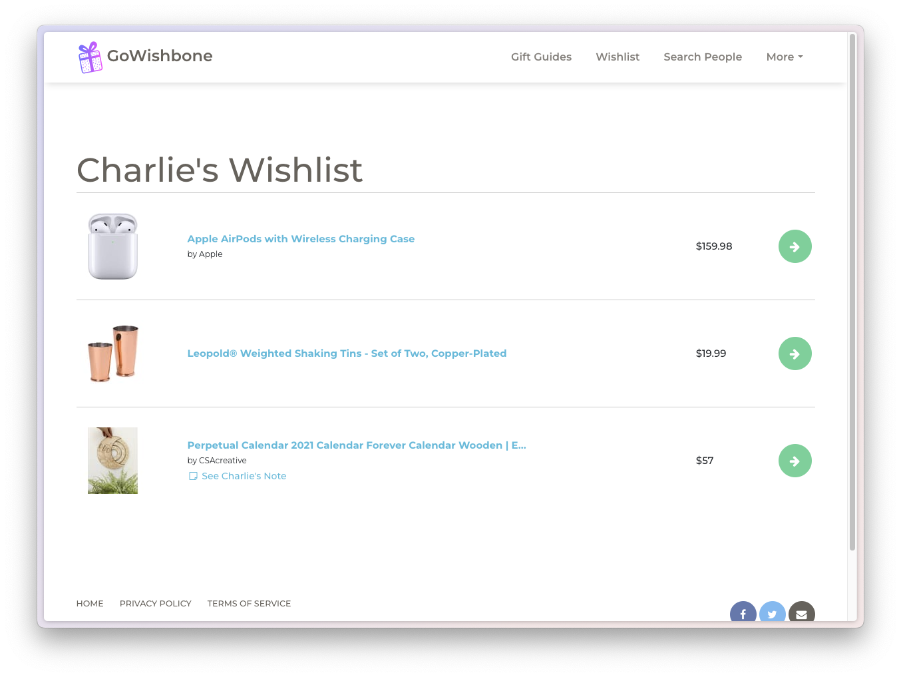
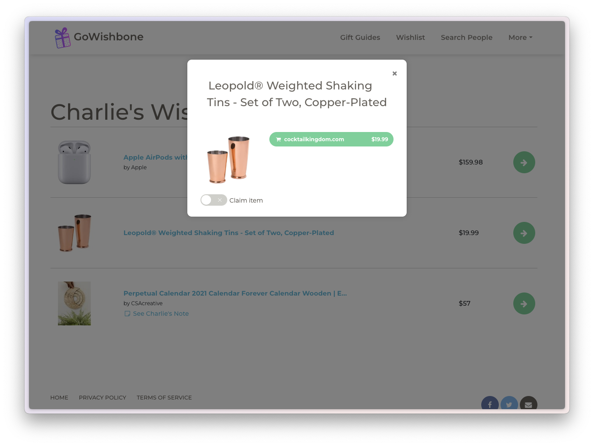
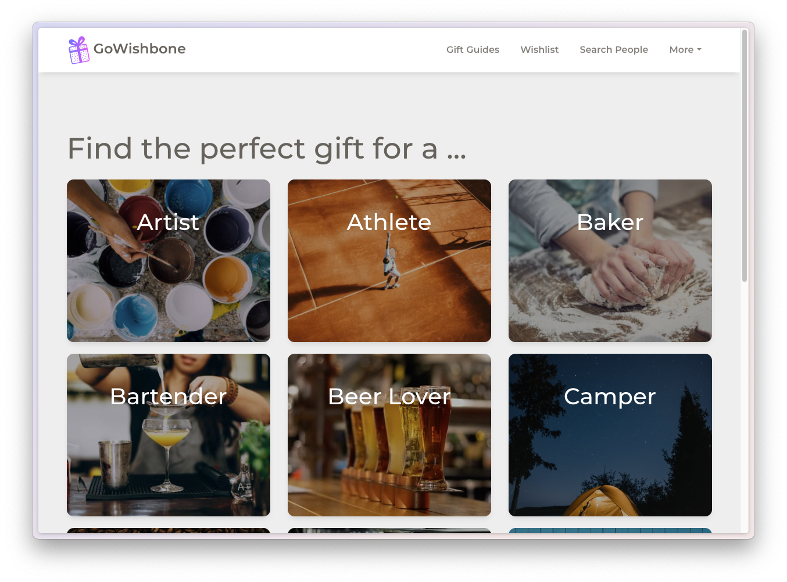
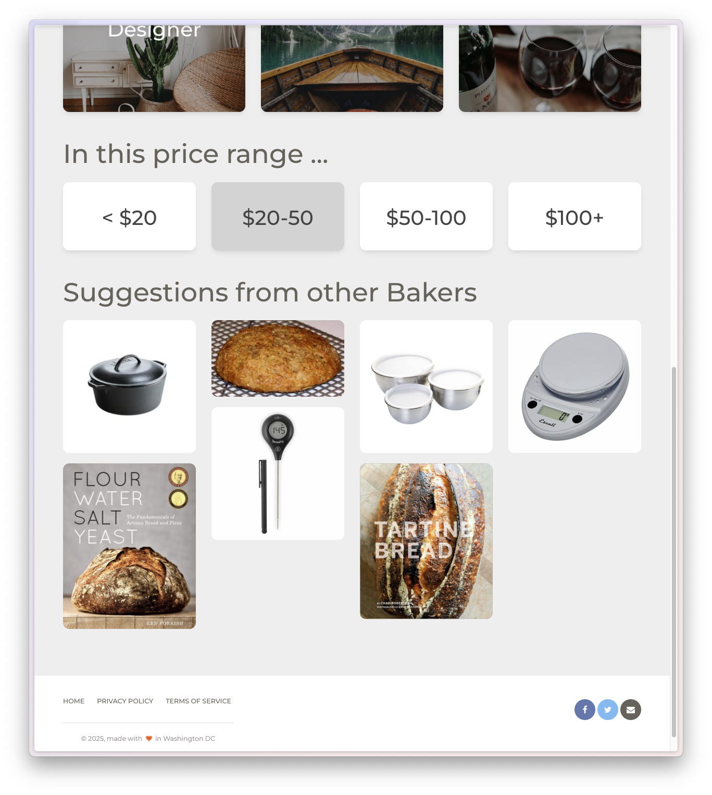
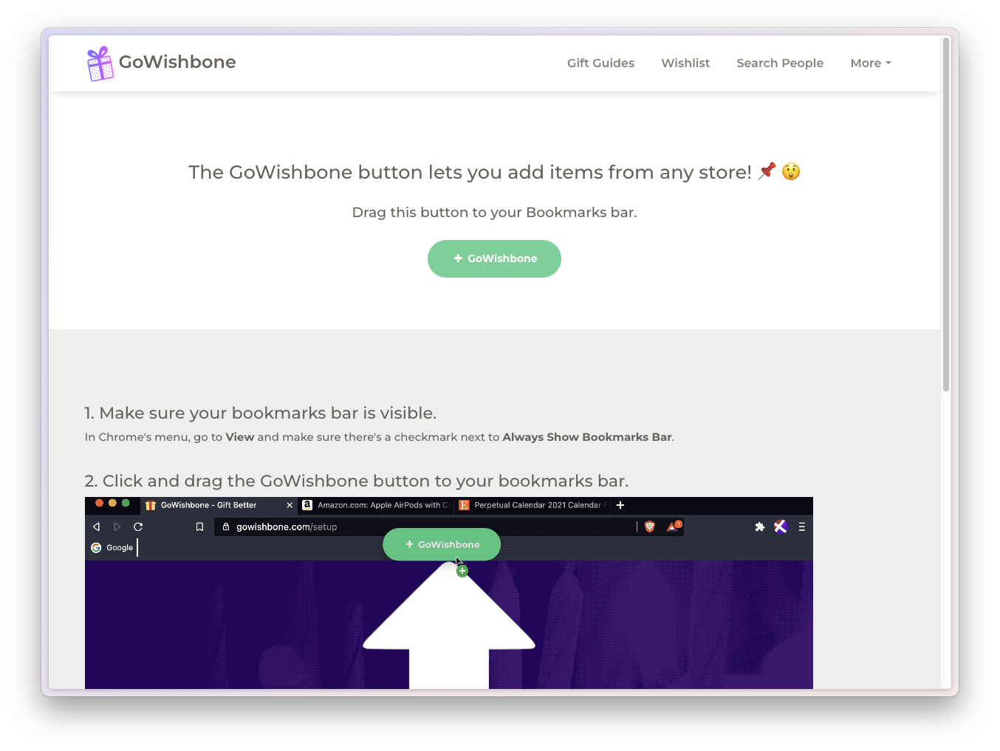

### Landing Page

*GoWishbone landing page for unauthenticated users*

### Home Page

*GoWishbone home page for authenticated users*

### Edit Items

*Edit wishlist item*

### Search and Claim

These are the flows that allow you to search for a user and claim items on their wishlist so they don't get gifted the same thing twice.

*Search for a person*

*Charlie's wishlist*

*Claiming an item on Charlie's wishlist*

### Gift Guides

*Find a gift idea by hobby*

*Filter on price and see resulting suggestions*

### GoWishbone Button

This is a javascript-enabled button that allows you to grab product details from any page and save it to your wishlist.

*GoWishbone button*
