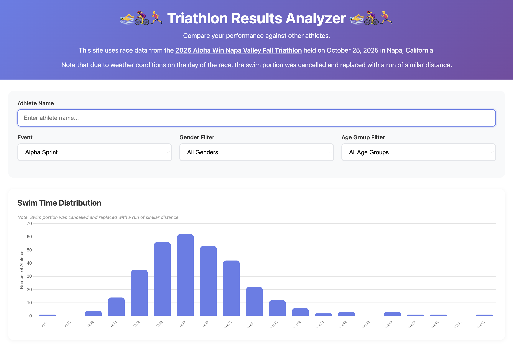
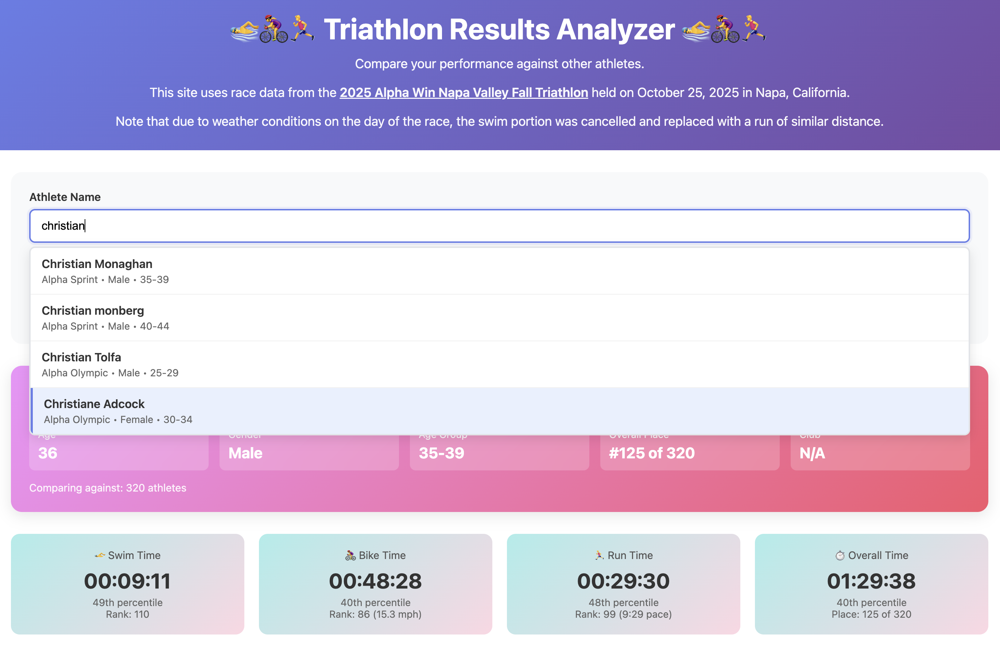
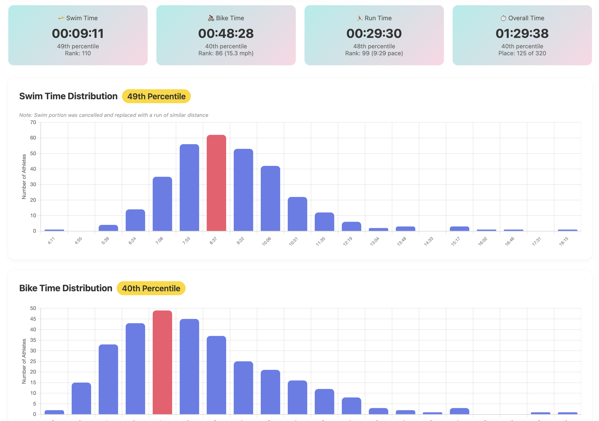

I recently participated in my first triathlon. (Yay me!) Afterwards, the race organizers provided the race results in a 32-page PDF that listed each athlete, their finish time for each leg of the event, and the finishing position for each athlete relative to others in their same gender and age group. However, there were only 19 participants for my age and gender. I was curious how I did relative to a larger sample size including a wider range of age and gender.

I was able to complete this project in about 4 hours. The hardest part was parsing the dataset from a 32-page PDF with inconsistent formatting.

I was able to make this dataset machine-readable by feeding it to Claude and asking it to use OCR to extract each participant's race times and append it to a CSV. This took a bit of manual effort and iteration, but eventually we got there.

*This is how the page looks before any athlete is selected*

*This is how the athlete name auto-complete feature works*

*See percentile distributions for a given athlete*
